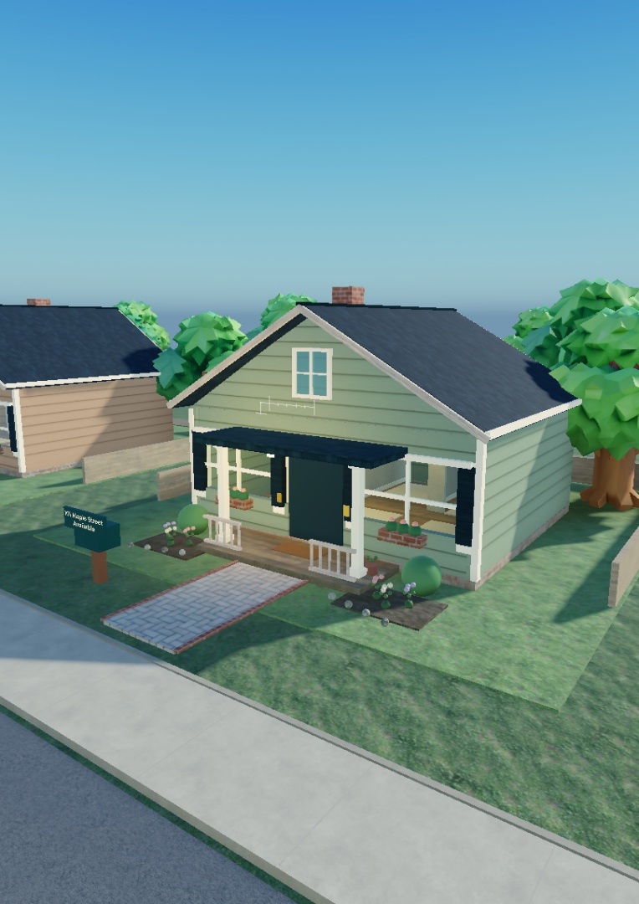

# The Neighborhood

A Roblox social sandbox about settling into Maple Street, making friends, collecting unusual possessions, and investigating the trouble next door.

**Development build — the complete master specification is not finished.** This repository contains the editable game, authored world, generated artwork, Studio build, and recorded test evidence. Passing Studio tests is not a production-release certification.



## Systems in this build

- Eight furnished homes, two shops, gardens, a community park, deliveries and a five-clue collectible trail.
- Server-authoritative money, purchases, item ownership, display placement, storage and pawn sales.
- Physical theft and carrying, locks, protection rules, evidence, investigations and recovery of original possessions.
- House customization, a purchasable car, a companion dog, weather, community activities and progression.
- Persistent player profiles with session leases, retries, migration and separate development/production storage.
- Friend parties, invitations, ready checks and saved invite-only neighborhoods. Nearby plots are picked automatically; players can choose an unclaimed address before moving in. Saved addresses stay reserved while members are offline.
- A phone interface for inventory, activities, settings, friends and neighborhood invitations.

Friend-travel orchestration is implemented and tested with an injected transport adapter. **Published-client teleports, native friend/privacy behavior and cross-server profile handoff remain to be verified.**

## Open or build

Download [builds/TheNeighborhood.rbxl](builds/TheNeighborhood.rbxl), then open it in Roblox Studio. This is an openable snapshot; source and the Rojo project are the maintainable version.

Rebuild with [Rojo 7.7.0](https://github.com/rojo-rbx/rojo/releases/tag/v7.7.0):

```sh
rojo build default.project.json --output builds/TheNeighborhood.rbxl
```

Read [Build and Studio setup](docs/BUILDING.md) before live sync or persistence testing. No Roblox credentials or reserved access codes are required to build.

## Documentation

| Guide | Contents |
|---|---|
| [Documentation index](docs/INDEX.md) | Current guides and historical evidence |
| [Build and Studio setup](docs/BUILDING.md) | Dependencies, Rojo, storage and fixtures |
| [Architecture](docs/ARCHITECTURE.md) | Services, authority, saves and travel |
| [Testing](docs/TESTING.md) | Repeatable tests and latest results |
| [Release status](docs/RELEASE.md) | Publication status and release gates |
| [Friends and neighborhoods](docs/FRIENDS-NEIGHBORHOODS.md) | Parties, invitations, plot choice and recovery |
| [Art redesign](docs/GARDEN-REDESIGN.md) | Environment changes and art QA |
| [Asset inventory](docs/ASSETS.md) | Provenance and portability |
| [Specification coverage](docs/SPEC-COVERAGE.md) | All 239 numbered sections, including open work |
| [Original specification](docs/specification/roblox_codex.txt) | Preserved user-supplied master brief |
| [Roadmap](docs/ROADMAP.md) | Milestones and outstanding work |

## Layout

```text
src/shared/       Configuration, definitions, theme and plot geometry
src/server/       Gameplay services, persistence and gated tests
src/client/       HUD, phone screens, input, feedback and weather
assets/           Editable world snapshot and art
marketing/        Experience icon and covers
builds/           Openable Roblox Studio snapshot
tools/            Authoring, export, packaging and repository checks
docs/             Guides, requirements coverage and QA evidence
default.project.json   Rojo source-to-service mapping
```

## Verification and release boundary

Recorded checks include three-client friends/plot tests, 56 nearest-plot choices, 23 navigation routes, eight-client functional capacity, gameplay regression, storage fault tests and real DataStore fixture save/reload tests. See [Testing](docs/TESTING.md) for limitations.

GitHub Actions validates repository files and builds a downloadable `.rbxl` with a pinned Rojo release. It **does not run Studio gameplay tests or publish the game**.

Target place: `111572448337932` · Universe: `10767699101`.

The last verified published version was **37**. Later environment, friends and plot-selection revisions are in source/Studio and this build; they have not been published. Public availability was previously blocked by Roblox account eligibility and must be rechecked in Creator Dashboard. The full specification, device testing, public-client travel and unfamiliar-player playtests remain incomplete.

## Ownership

Private project repository. No open-source license has been selected. Generated images, Roblox-hosted assets and dependencies remain subject to their applicable terms and permissions. See [Asset inventory](docs/ASSETS.md) before reusing under another Roblox owner.

## Optional cosmetic passes

[Maple Style Boutique](docs/MONETIZATION.md) adds six home finishes across two registered permanent passes. Passes remain off sale until this revision is published and live delivery is verified.
