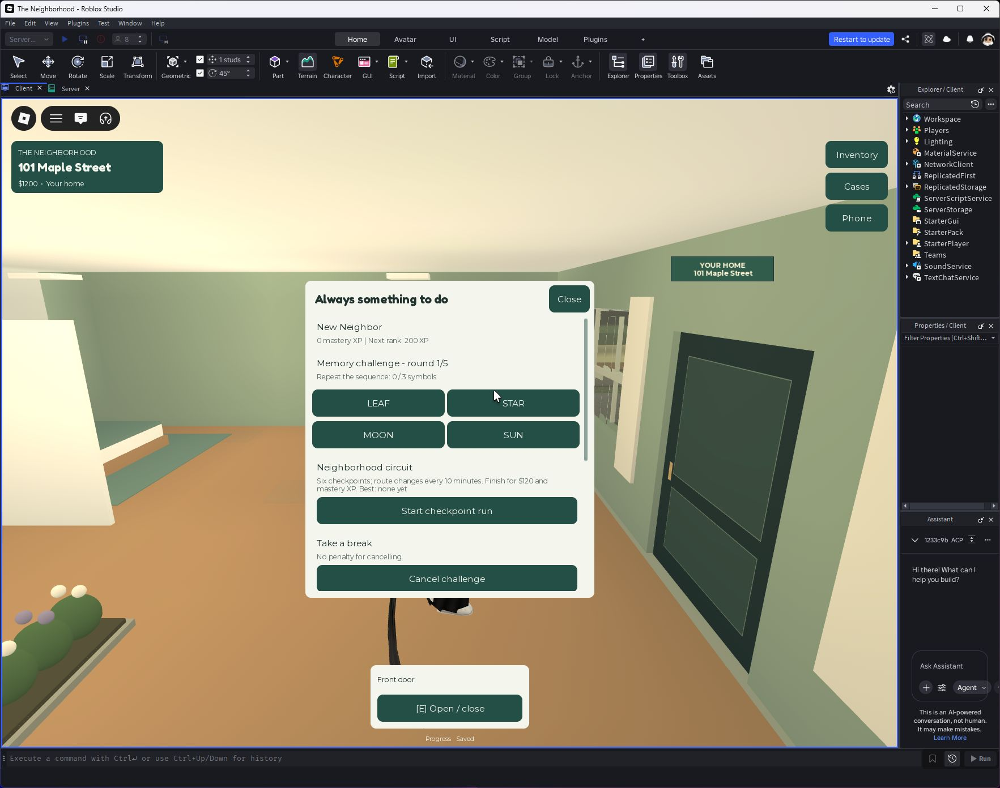

# Activities and replayable goals

Phone > Activities brings the repeatable play loop into one place, above the existing phone destinations.

- **Neighborhood circuit:** six on-foot checkpoints around the town, with a private floating navigation marker. Route start and direction rotate every ten minutes. Completion awards $120 and 30 mastery XP, subject to a 90-second reward cooldown; personal-best time persists. Position jumps, death, sitting in vehicles and ten-minute timeouts cancel a run.
- **Memory challenge:** repeat sequences using four named symbols. Five rounds increase sequence length from three to seven. The sequence disappears before input is accepted. Completing round five awards $80 and 25 mastery XP, with a 90-second reward cooldown. Wrong answers end the attempt; restarting is free.
- **Three daily objectives:** finish a circuit, finish a memory challenge, and complete three jobs/trials. Deliveries, fishing, radio repair and rewarded meadow trials count toward work. Each objective pays $100 and 50 mastery XP once per UTC day. There are no streak penalties or paid resets.
- **Five mastery ranks:** New Neighbor, Street Explorer, Local Favorite, Town Champion and Maple Legend, at 200-XP intervals. Ranks are labels in the Activities screen; they do not sell power or multiply rewards.

The profile stores mastery, best circuit time, finish count and daily reward receipts. Active runs and memory sequences are session-only. Existing profiles receive defaults through migration. The server owns sequence validation, route progression, timing, rewards and claims. The memory sequence necessarily reaches the client while being shown; this is a casual minigame, not an exploit-proof competitive leaderboard.

The Activities screen also points players to existing gardening, home building, mysteries, community events and stories. This update adds a repeatable loop; it does not claim that every original master-spec feature is complete or that a finite game has infinite content.

## Verification and release

Published as v77 on September 24, 2026 at 11:20:06 UTC, confirmed by Studio. A real Studio character completed all six checkpoints; five actual timed memory rounds passed. Wrong/early/invalid input, teleport shortcuts, duplicate claims, reward cooldowns, UTC rollover, mastery preservation and repository save/reload passed using an isolated profile fixture. A real client remote request showed and hid the sequence correctly, and all four answer buttons rendered at 48-pixel height. Reward upper bounds passed. This was a single-player Studio acceptance run, not live multiplayer load testing.

[Recorded checks](qa/activities.json). Reproduce using `tools/test-activities.server.luau` in a Studio server session.

