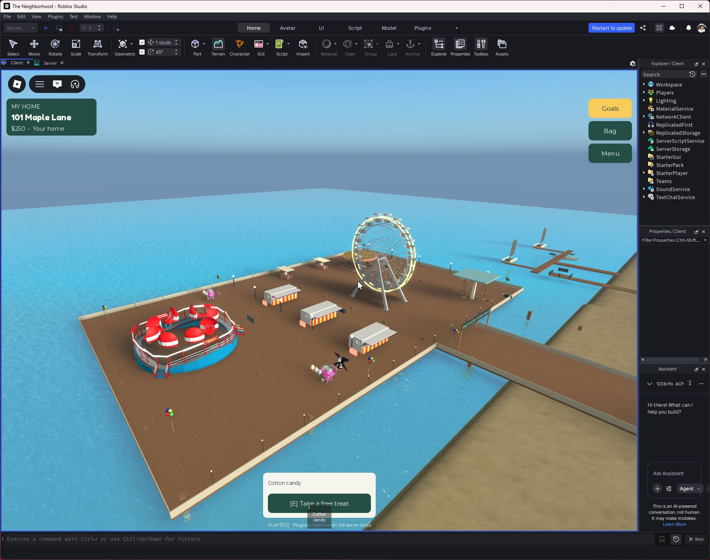

# Pacific Pier carnival expansion

The north pier now has a connected 180 × 110-stud extension for the imported **Seabreeze Spinner**, a Tilt-A-Whirl-style attraction with eight spinning cars and 32 boarding seats. Players use the server-validated boarding sign and jump to dismount. The ride uses locally authored animation/boarding code; none of the imported scripts run.

Three detailed imported booths replace the plain skill-game counters. Existing timing/reaction games and their reward limits remain. Two imported candy stalls offer free equippable cotton candy: tap while equipped to consume it. Treats are temporary, cannot be dropped, and are limited to one per player at a time. Eight anchored balloon clusters, perimeter bulbs, support piles, safety rails and an entrance marquee complete the new layout. The extension joins the original pier without the old north railing blocking passage.

## Asset sources

Free Creator Store listings inspected September 24, 2026:

| Model | Listing creator | Source |
|---|---|---|
| Carnival game booth Food Games Carnival Fun | LightFire3059 | [130405390971611](https://create.roblox.com/store/asset/130405390971611) |
| Tilt-A-Whirl Carnival Ride Amusement Park Fun | Dark57Crazes1107 | [90901195852714](https://create.roblox.com/store/asset/90901195852714) |
| Cotton Candy Stall Sweet Booth Shop Cart RP Vibe | programematic | [90652939990774](https://create.roblox.com/store/asset/90652939990774) |
| Bunch of Balloons | HipHopElite | [212676394](https://create.roblox.com/store/asset/212676394) |

Listing attribution is not independent certification of authorship. No purchases were made. Imported code, remotes, sounds, regeneration copies, controllers and constraints were stripped; balloon gear containers became inert models. Original CSG geometry is preserved in **assets/CarnivalArt.rbxm**, exported with Studio SerializationService and included in the Rojo build. This avoids flattening curved ride cars into placeholder boxes or requiring marketplace downloads at runtime. The candy tool and joining deck are locally authored.

## Verification and limits

Initial Studio playtest: the new ride boarded through InteractionService, held the player seated and moved 8.07 studs in a two-second sample. The candy interaction succeeded and placed the treat in the player's backpack. Visual inspection caught the old north railing across the extension; CoastalFinish now leaves that join open and avoids duplicate side rails.

The native model export and Rojo build passed. Imported meshes/textures and CSG rendered in Studio. Full 32-player ride occupancy and physical low-end mobile performance have not been tested. Decorative imported booths/ride skins are non-colliding; authoritative boarding seats and the deck provide the gameplay surfaces. Cotton candy and balloons do not alter saved economy or progression.

Final checks confirmed clear collision paths through the entrance and extension join, zero imported executable scripts/remotes, successful treat collection, duplicate-treat rejection, and client equip/activation consuming the tool. The first path-check harness incorrectly treated a non-colliding decorative post as an obstruction; it was corrected to query collidable geometry.

