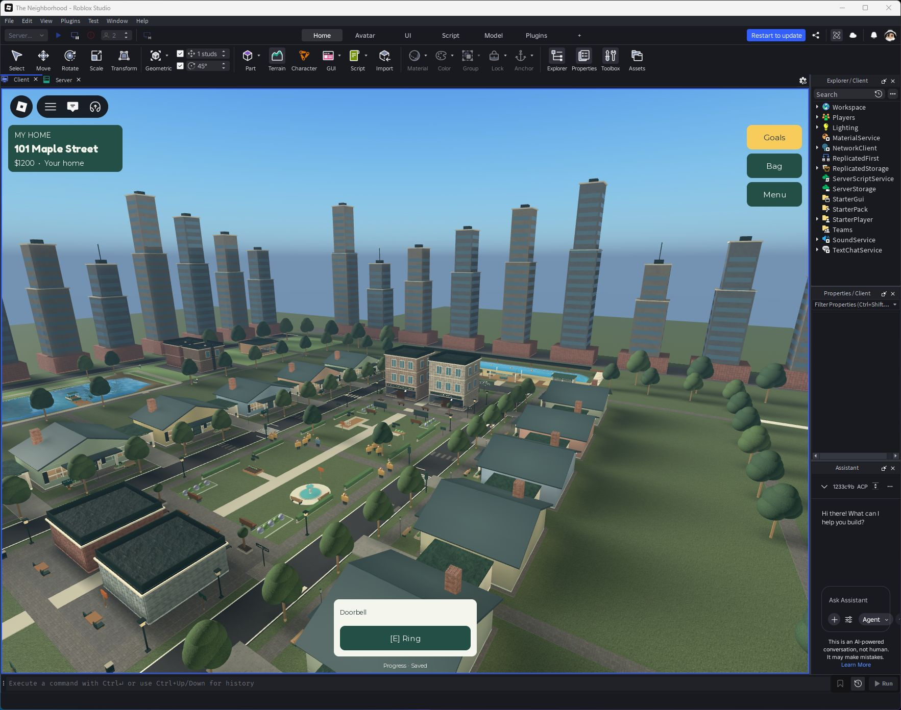

# Closer homes and a taller city

The house rows move three studs inward per side: foundation-center separation changes from 224 to 218 studs. All 12 plot IDs remain stable. Mailboxes retain their roadside locations; front paths shorten rather than sliding onto the road. Garages, room expansions and home markers build from the relocated foundation.

Four story landmarks (west/east letterboxes and market/pawn notices) previously used scaled X coordinates that placed them on asphalt. Their definitions now locate both the signs and navigation targets at X ±44.8, beside the street.

The perimeter skyline is replaced by 42 towers with brick podiums, setback terraces, window bands, roof plant and occasional spires. North and south city blocks have paved bases. These are exterior scenery, not 42 new accessible interiors. Existing playable homes, shops and activities stay clear.

Verification: checked all 12 foundation positions and garage presence; identified and relocated four road signs with their supports; inspected the skyline in play mode. Supported coplanar-face audit returned zero after refinement. Multiplayer housing regression and final release evidence are recorded below.

Published as **v104**, confirmed by Studio PublishSuccessful at **18:07:48 UTC, September 24, 2026**. Two-client ResidenceAcceptance passed on the new layout (`qa/city-density-housing.json`). Final fresh runtime inspection found zero street-sign centers over asphalt, 42 towers and 12 foundations at X ±109. Walked the shortened house approach.

