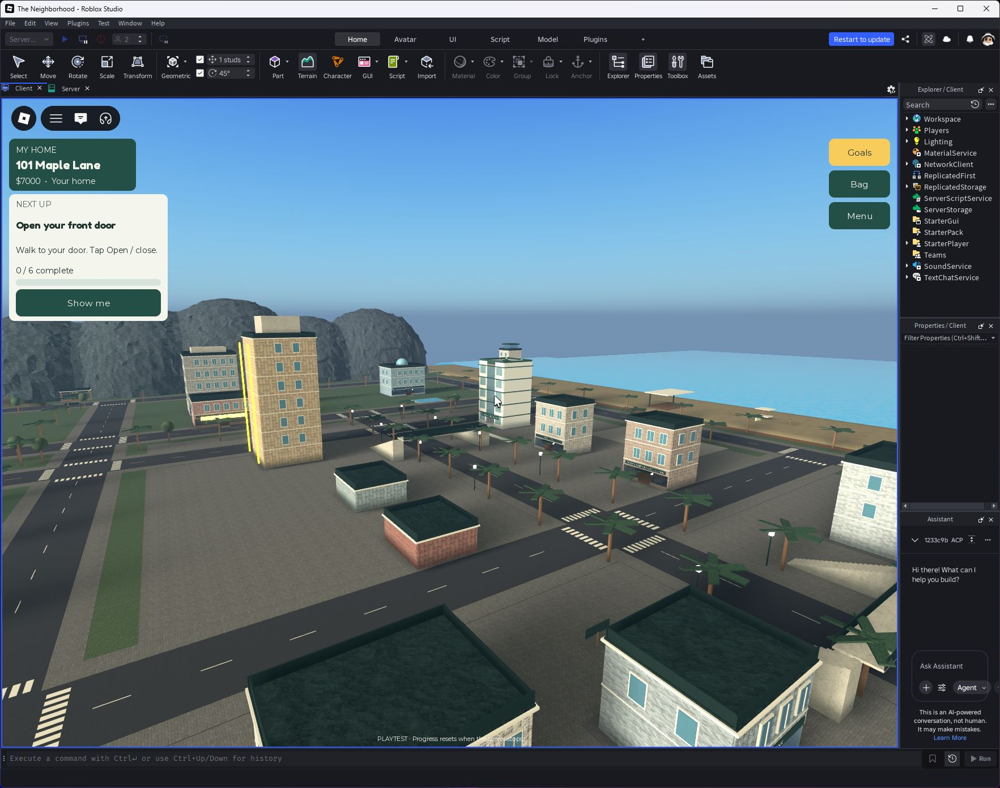
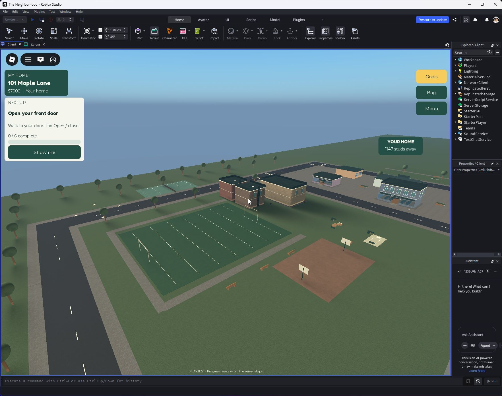
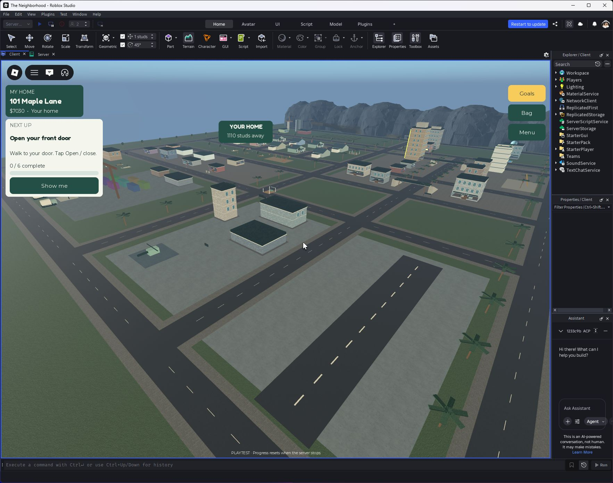
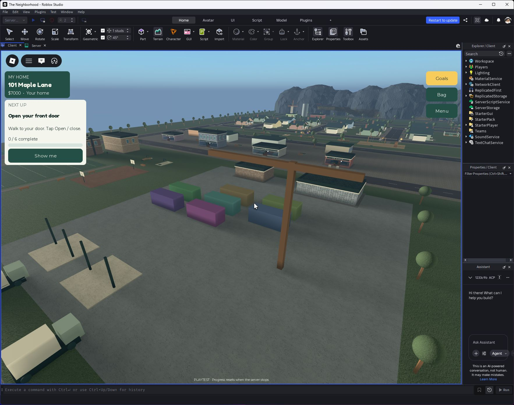
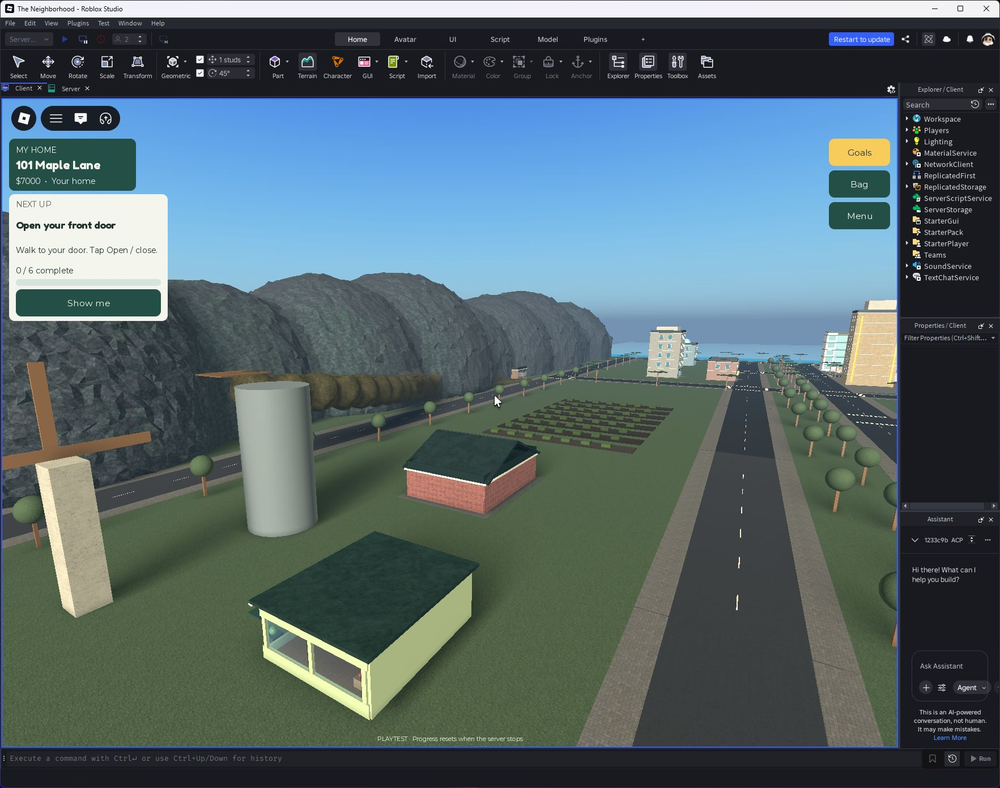
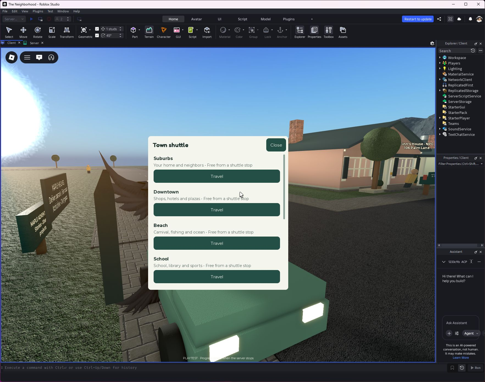

# Coastal districts

September 24, 2026. This redesign supersedes the compact ring of buildings around the houses. The original house shapes and twelve house IDs remain; the map now separates residential, commercial, downtown, coastal and countryside destinations.

Published to The Neighborhood as **v117** at **19:18:04 UTC**. The map is assembled by the server at startup; Studio's stopped Edit viewport retains the legacy seed geometry. Start Play or join a new Roblox server to see the coastal layout.

## What is built

| Requested area | Implemented layout and content |
|---|---|
| Suburbs | Three connected streets: Maple, Palm and Sunset lanes. Four homes on each street, two per side. Existing cottage shapes, twelve garages, driveways, mailboxes, rear patios and garden fences. Neighborhood park with paths, benches, play equipment and existing activities. |
| Downtown | Separate Sunset Boulevard, hotel with stepped crown and illuminated fins, apartments, civic hall, bank, clinic, library, resort, domed gallery, theater, plazas, fountain, monument, pedestrian bridges and ground-floor shops. Buildings have furnished accessible floors and lift interactions. |
| Commercial strip | Existing corner cafe, general store, pawn shop and repair workshop; clothing boutique, cinema, car showroom, fuel/snack store and a pedestrian shopping promenade. |
| Beach | Pond replaced by terrain ocean and sand. Boardwalk, lifeguard platforms, umbrellas, changing rooms, fishing pier, tackle store, marina docks, cruise boat, moored sailboats, lighthouse and outdoor stage. |
| Carnival | Pacific Wheel with eight cabins, six-seat carousel, four-seat rotating swings, three timed-green skill booths, benches, lighting and free popcorn. |
| School | Furnished two-floor school, reading rooms, football field, basketball and tennis courts, baseball bases, ball rack and walking circuit. |
| Industry | Parcel warehouse, container yard, construction frames/crane, trucks and a factory with an eight-second packing job paying $30. |
| Airport | Runway and threshold markings, terminal, control tower, hangar/trainer display, helicopter/helipad and a free 45-second sightseeing plane route. |
| Countryside | Barn, orchard stand, planted fields, greenhouse, windmill, silo and connected country road. |
| Mountains | Walkable rising trail, lookout deck, cabin, campsite with tents and seating, rock cave entrance and decorative waterfall. |
| Navigation | Connected road graph, crossings, purposeful roadside signs and eight shuttle stops. A single readable destination menu replaces clusters of destination signs. Existing home marker and task guidance use the new locations. |

## Interaction and progression

Existing home ownership, upgrades, stored furniture, shopping, jobs and optional mischief remain. Player house IDs are unchanged. Unoccupied homes retain NPC neighbors and their door-based home/park routines. New garages do not grant free owned cars; existing vehicle ownership governs spawning and purchases. The fixture used for testing deliberately owns a compact car.

The carnival skill booths reward timing with $8; they use a shared timing mechanic rather than three separate physics games. The sightseeing plane follows a route; it is not a free-flight simulator. The ferry and carnival rides move. Display cars, industrial trucks, the helicopter, parked trainer and moored sailboats are scenery or seating, not additional driveable vehicles. Civic buildings and the school support exploration/roleplay; they do not imply a full banking or classroom simulation. Playground swings are seats; the carnival swings rotate.

## Verification

The reproducible [acceptance script](qa/CoastalAcceptance.luau) runs only against a session-only Studio fixture. Test profiles are not published and do not overwrite player saves. Checks cover road connectivity, three streets of four houses, eight shuttle destinations, twelve garage spawns and collision-free road lanes. See [test results](qa/coastal-results.json) for the final run.

Additional bounded checks covered real terrain swimming, all three carnival ride types, the factory reward, the sightseeing flight and entrance/lift geometry. Visual captures are actual Studio play-session images, not concept art. This is a single-client redesign check. Twelve concurrent players, low-end mobile performance and full live save/rejoin migration have not been revalidated for this larger map.

## Screenshots

## Design references

Santa Monica's [neighborhoods](https://www.santamonica.com/experience-santa-monica/neighborhoods/) and [pier / Ocean Avenue](https://www.santamonica.com/experience-santa-monica/neighborhoods/santa-monica-pier-ocean-avenue/) informed district separation and the coastal promenade. The [Las Vegas Strip](https://www.visitlasvegas.com/las-vegas-strip/) informed clustered landmark silhouettes, resort frontage and pedestrian bridges. The game contains no wagering implementation.

This is a stylized Roblox construction using the project's existing architectural vocabulary. It is not a reproduction of the reference image's photorealistic assets, and the original master specification remains a separate historical scope.
