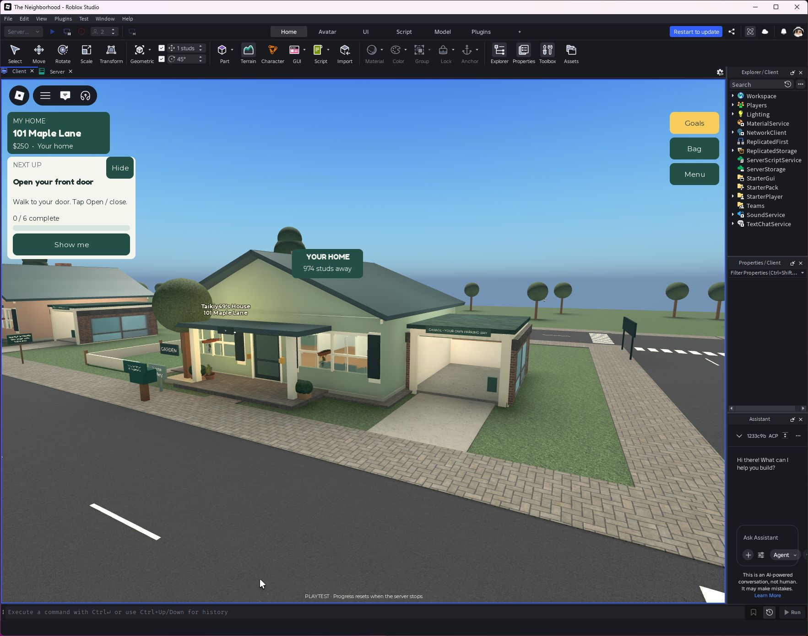
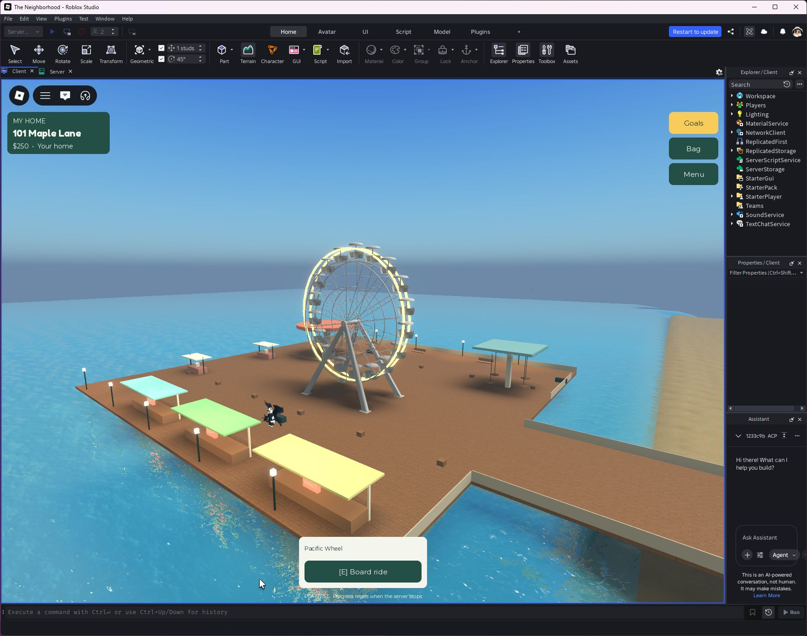
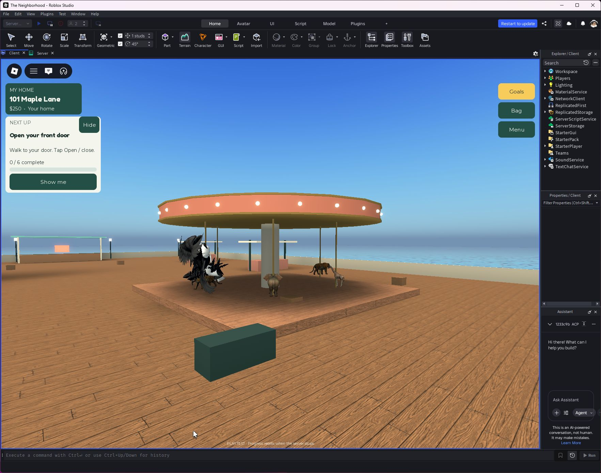

# Curated environment art

This pass replaces repeated primitive façades with imported mesh architecture and replaces the aircraft and Ferris-wheel visuals. Existing progression, plot IDs, collision shells, interiors and server-owned interactions remain authoritative.

## Imported sources

| Source | Creator Store ID | Use |
|---|---|---|
| Roblox — Modular Building Kit, Modern City | [13168370735](https://create.roblox.com/store/asset/13168370735) | Four façade styles, awnings, fire escapes, rooftop equipment, planting |
| TheRealEpicSammy — Cessna 150, Mesh & Textured | [2803710075](https://create.roblox.com/store/asset/2803710075) | Two-mesh sightseeing aircraft skin |
| Grammarly_exe — Helicopter (No guns) | [8915950341](https://create.roblox.com/store/asset/8915950341) | Static airport helicopter geometry |
| MaxEnough — Working Ferris Wheel | [3751786052](https://create.roblox.com/store/asset/3751786052) | Wheel structure and 18 upright passenger cabins; included script credits Miscool_Gaming |
| GabriellaM00n7145 — East Coast Merry Go Round | [76195113897733](https://create.roblox.com/store/asset/76195113897733) | Three animal meshes for the six existing carousel positions |

All were listed free on the Creator Store when imported on September 24, 2026. Store attribution identifies the listing provider, not an independent authorship certification. No paid assets or plugins were purchased. Imported scripts, remotes, sounds, controllers, constraints and asset links were removed; only curated geometry/material data is shipped. The first airliner and Ferris-wheel candidates were rejected for excessive complexity. No external ride/flight code executes in this game.

Roblox documents the official kit and its modular workflow in [Assemble modular environments](https://create.roblox.com/docs/tutorials/use-case-tutorials/modeling/assemble-modular-environments). Assets are stored in `assets/CuratedArt.model.json` and mapped to ServerStorage by the Rojo project, so the repository build contains the same geometry. Runtime insertion does not depend on InsertService permissions or live marketplace downloads. Mesh/texture delivery still uses Roblox's asset service.

## Integration

CuratedArchitecture uses separate cosmetic layers for façades, small-shop details, cottage planting/windows and garage sides. Doors, paths and saved display targets keep their original collision/interaction ownership. Building façades include front, side and rear treatment; upper-floor styles, plaster/brick choices, canopies and roof equipment vary by building. The underlying building masses and established floor plans remain, so this is an art upgrade rather than a completely new city layout.

The imported wheel is animated by the existing server ride system. Its 18 cabins remain upright as the wheel rotates, with one boarding seat per cabin. The carousel retains six controllable seats and uses imported animal sculptures plus poles. The light plane follows the existing 45-second sightseeing route; the helicopter remains a static airport display, not a flyable vehicle. The Ocean Swings retain their current geometry and controls.

This does not claim every prop is finished to a final art standard. The public buildings, cottages, garage sides and main airport/pier landmarks receive this pass; landscaping, street furniture, traffic vehicle models, swing-ride styling and future residence-tier silhouettes remain further art opportunities.

## Screenshots

## Verification

Studio session-only checks on September 24, 2026:

- 31 main-building façades, six smaller shops, twelve cottage detail groups and twelve garage detail groups generated.
- All 93 entrance ray samples across the 31 main buildings were clear of solid obstructions.
- Zero imported scripts/remotes/sounds in the curated library. Zero colliding, touching or queryable parts in the main cosmetic façade layers.
- Pacific Wheel, Seaside Carousel and Ocean Swings boarded through InteractionService, remained seated and moved 4.51, 6.14 and 5.96 studs respectively during two-second samples.
- Sightseeing flight boarded, remained seated and moved 134.65 studs during a three-second sample. After the full route, the player was unseated, unanchored and within 0.09 studs of the airport return position.
- Visually inspected the pier, airport, diner, downtown and cottage/garage. Removed overlapping awnings, restored twelve-stud upper-floor repetition and repeated fire escapes by floor instead of stretching a single escape over the whole tower.
- Repository checker and Rojo build passed. Rojo reports the existing harmless top-level model-name warning.
- The close-up carousel inspection caught stale imported pivots putting animal meshes off-map. Place now resets WorldPivot after transforming parts. A fresh session confirmed all six animal bounding-box centers match their moving pivots (zero offset), with successful boarding and a seated rider. Lowered and detailed the canopy to suit the ride scale. Final fresh-session console contained only the normal Ready message.

Initial test harness errors (clearing a seat before retaining its occupant, incorrect Attractions path and attempting to access PlayerScripts on the server) were corrected before the successful runs. These were test-code failures, not concealed gameplay passes. Saved game progress was never edited by the art migration. Large-server and physical low-end device performance are not inferred from a single Studio session.
