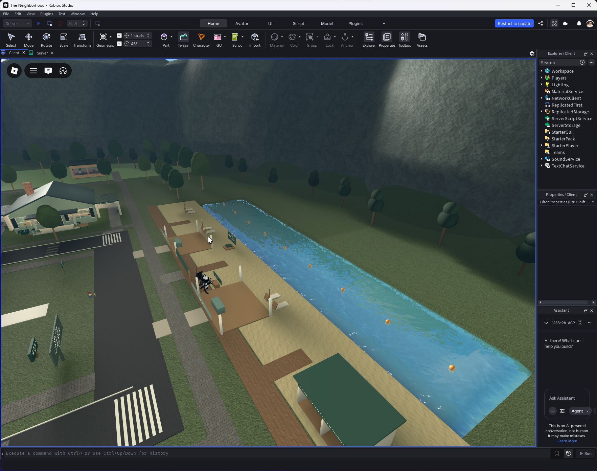
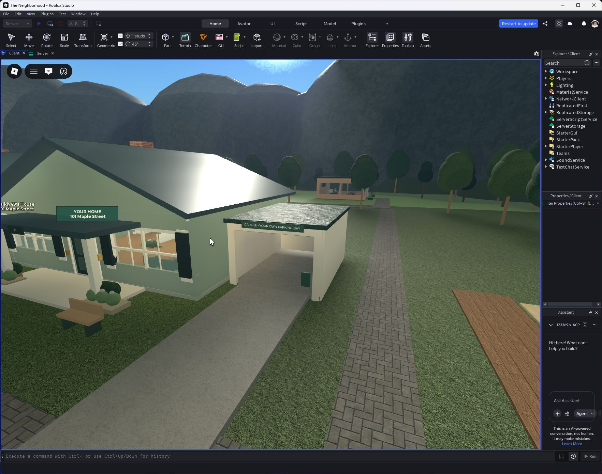

# Garages and Sunset Cove

Every one of the twelve cottages now includes an empty garage, overhead roller door, lighting, storage shelf, owner-only garage menu and driveway. New profiles still have no car. The Maple Compact costs $2,400 earned in-game cash; the existing ownership, color and plate fields persist. Purchase rejects insufficient cash and duplicate ownership. Recall places the car inside the garage and refuses obstructed parking. Existing car owners keep their car.

The previous paid garage expansion is now a storage/furnishing upgrade inside the included garage. Existing saved upgrade and furniture IDs remain valid, with revised local placement coordinates; it no longer adds a second garage shell across the street.

Sunset Cove is a separate northern swimming beach: a 200-by-40-stud terrain-water basin with a sloping sandy bottom, a 220-stud sand frontage, a boardwalk connected to town, three umbrella/lounger groups, changing alcoves, a lifeguard station, swim buoys and borrowable floating beach balls. It is a bounded freshwater cove, not an ocean simulation. Beach balls are limited to one per player, throw only from the cove and clean up automatically. The existing lake, fishing deck, ferry and four furnished side businesses remain in place.

## Checks

- A default profile owns no vehicle; unowned recall and insufficient funds are rejected.
- Purchase deducts exactly $2,400 once; duplicate purchase is rejected. Ownership and plate survive schema serialization/migration.
- The car spawned successfully in all twelve garage bays, tested sequentially with a profile fixture.
- A real player sat in the car and drove out of a garage.
- Home garage menu works; another home's menu rejects access.
- A real Humanoid swam in the cove.
- Beach-ball borrowing, duplicate rejection and physical throwing passed.
- Visual review found lawn clipping through garage paving; final paving was raised above the lawn and smoke tests repeated.

Tests used isolated vehicle-profile fixtures rather than spending the user's saved currency. The smoke test is saved in `tools/test-garages-cove.server.luau` for manual Studio server execution. This was not a twelve-client simultaneous driving stress test, nor a live production purchase/rejoin test.

Published September 24, 2026 at 11:11:22 UTC; Studio confirmed PublishSuccessful and linked notes to v75. [Machine-readable results](qa/garages-cove.json).
