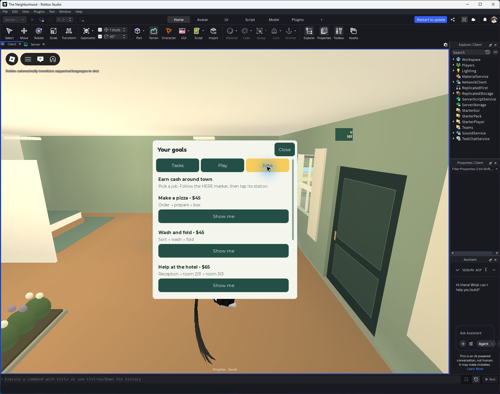
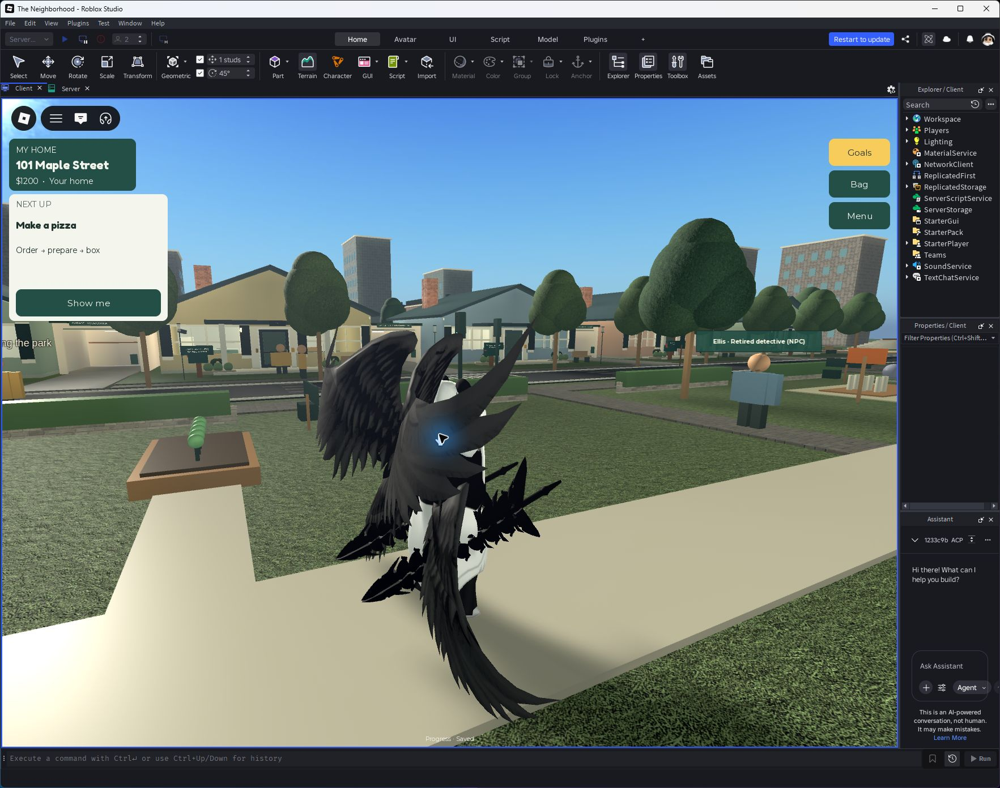

# Goals and readable play — September 24, 2026

The user asked for a more straightforward interface for younger and older children, with organized tasks and visible progress. This release changes the interface and guidance; it does not claim the entire original master specification is complete.

## Player experience

- Goals, Bag and Menu replace the crowded four-button navigation.
- Next up shows one action, short instructions and a Show me destination marker.
- Goals separates Tasks, Play and Jobs. First steps show the next unfinished task; daily goals and rank have numeric progress bars.
- Active city jobs show the correct next station, completed steps and preparation countdown.
- Menu groups home, exploration, social and help features. Optional Robux cosmetics stay in the home submenu.
- Larger body text, 48-pixel actions, selected-tab color and controller selection outline improve legibility.
- Memory-game shapes have names as well as symbols.
- The introduction waits for Next or Skip; it no longer moves ahead while someone reads.
- An NPC greeting completes the neighbor introduction once. Repeated greetings do not award repeated tutorial XP.
- Menus suppress underlying interaction cards; notifications temporarily hide the task card to avoid overlap.

## Actual Studio captures

## Verification

- [Two-client UI acceptance](qa/goal-ui-runtime.json): 274 rendered screen/state checks, 510/360-pixel panels, four HUD size fixtures, loading, complete, reward-ready, memory and checkpoint states. All passed.
- The same suite runs actual NPC and pizza-station interactions: correct guidance attributes, early-action rejection, unchanged $45 reward, completion/expiry cleanup and no repeated introduction XP.
- [Network regression](qa/goal-ui-network.json): 830 requests, four character reloads, no application errors; possessions, house and one HUD retained.
- Real mouse clicks opened Jobs and selected Show me; the menu closed and a waypoint was created.
- A running LocalScript verified notification hiding and that the tour remained at 1/4 after eight seconds; Finish restored the camera and app.
- [Strict static design audit](qa/goal-ui-static.json): zero findings.
- DESIGN.md lint: zero errors, six orphaned-token warnings because the minimal component metadata does not reference every runtime Theme token.
- Rojo build and repository link/JSON validation passed. Existing Rojo model-name warning remains.

## Scope and limits

Viewport fixtures run in Studio; physical mobile hardware, physical controller input and usability sessions with children were not tested. No claim of accessibility certification. Existing servers require a fresh session for this release.

## Design ownership and drift

| Area | Canonical owner | Result |
| --- | --- | --- |
| Colors/type/controls | shared Theme → client UI | Runtime and DESIGN.md aligned |
| Navigation | GoalHUD, MenuScreen, Screens | All prior menu destinations retained |
| Progress and rewards | Server services | Bars use server state; no client reward authority |
| Job guidance | CityJobs → replicated attributes → TaskGuide | Completion and expiry clear active guidance |
| Intro | ArrivalIntro | Explicit Next supersedes historical timed-tour behavior |

Guidance informed by Roblox's [onboarding techniques](https://create.roblox.com/docs/production/game-design/onboarding-techniques) and [UI/UX design documentation](https://create.roblox.com/docs/production/game-design/ui-ux-design). This is an original interface adaptation, not a copied popular-game layout.
