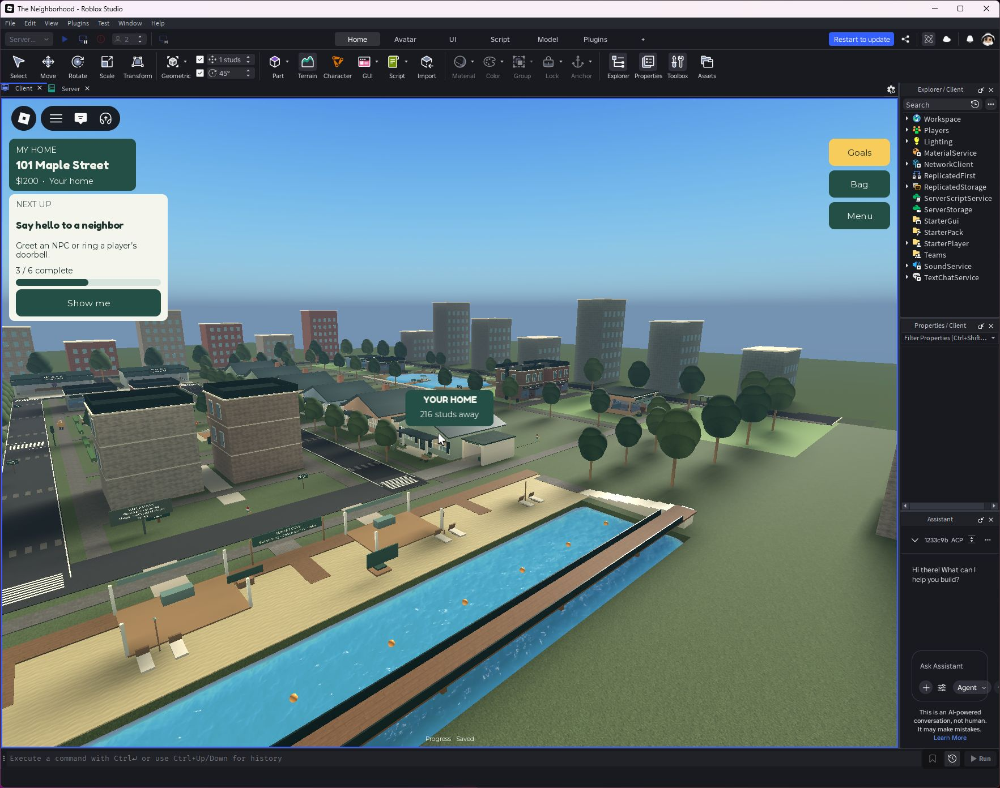

# Private home marker

Each player has one client-created YOUR HOME billboard with distance in studs. It appears above their own house, remains readable through buildings, and hides within 35 studs or while menus/the introduction are open. It points to the house in the player's current state, including after reassignment.

The server sends only the assigned house's foundation coordinates with the existing state snapshot. The client creates a non-colliding, non-queryable local anchor, so the marker still works when the house model streams out. The marker is not replicated to the server or other players. It persists across character respawns and cleans up when the app is destroyed.

The marker shows the home when looking toward it; it is not an off-screen compass or a walking route.

UIAcceptance checks two clients have different house IDs and exactly one local marker each, while the server has no marker anchor. Client fixtures cover far/unstreamed coordinates, nearby hiding, reassignment, menus and no assigned home. Results are saved in qa/home-marker-runtime.json.

Replaces the old HomeMarker.client.luau, which stopped drawing beyond 160 studs and could be occluded by world geometry. The replacement is initialized once by App.

Verification passed: two real clients with House01 and House02, one private marker each, all 274 UI checks. A separate normal-play character reload preserved the marker; visible at 216 studs in the captured view.

