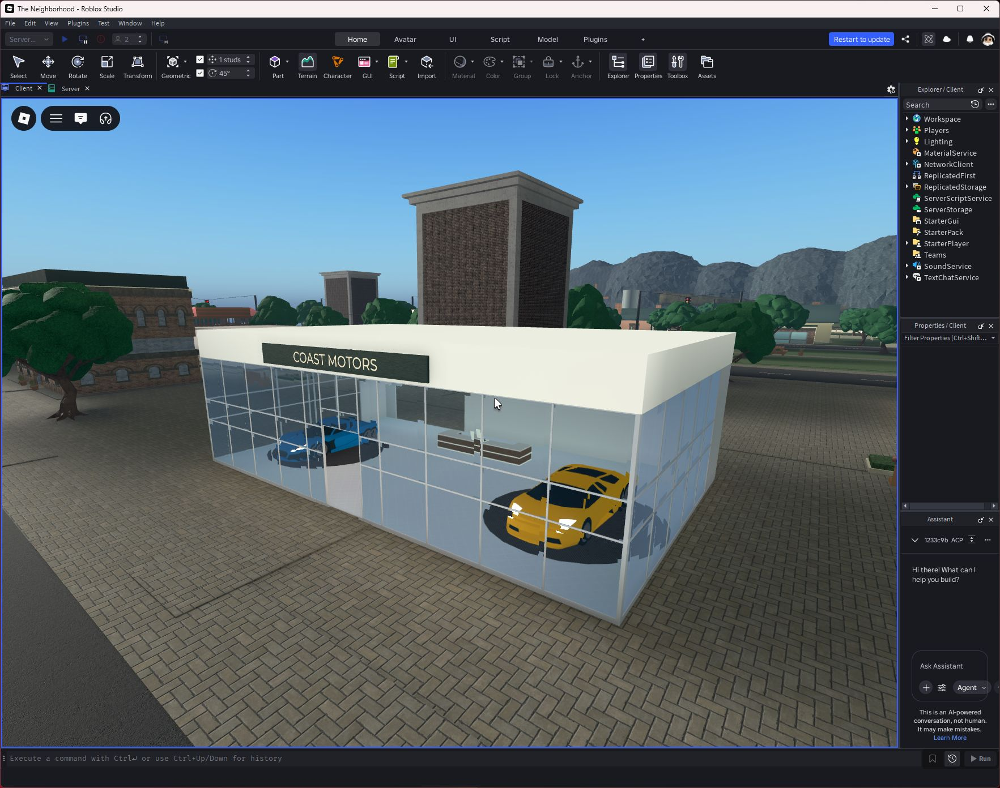

# Imported vehicles and auto shops

Published as **v152**, September 24, 2026, 23:52:45 UTC.

The road vehicle fleet uses Creator Store geometry. The existing server-owned arcade driving, saved ownership, prices, level gates, colors, plates and half-price resale remain in place. Imported vehicle scripts do not run.

## Sources

| Asset | Creator | Use |
| --- | --- | --- |
| [Low Poly Cars Pack](https://create.roblox.com/store/asset/120535861432410) | Ninja131Venom | Four catalog car bodies; six traffic cars; showroom and repair-bay displays |
| [Bicycle BMX](https://create.roblox.com/store/asset/10416886834) | soonyanhao2 | Boardwalk bicycle |
| [Delivery Truck](https://create.roblox.com/store/asset/8890560228) | lefthismarq | Two industrial delivery trucks |
| [Auto repair garage](https://create.roblox.com/store/asset/120675819652081) | Synolux67 | Repair building and an extracted glass showroom section, counters, lighting and fixtures |
| [Workbench tools workshop hardware](https://create.roblox.com/store/asset/119227303977130) | Ic3X7Sparkly37Blizza | Existing sourced repair workbench, retained in the new bay |

The source art is not our original artwork. Unused candidate imports were removed. The sanitized eight-template library is stored as native `assets/VehicleArt.rbxm`, preserving CSG geometry. The workbench remains in `VenueArt.rbxm`.

## Integration

- Removed procedural visible player-car bodies, wheels and cabins, traffic-car shells, showroom cars and depot trucks. Invisible chassis and driver seats retain the existing physics/control system.
- Mesh body panels support saved paint colors. The bicycle also has paintable frame parts.
- The imported shop has open service bays, a tool workbench and a car being serviced. The showroom has two imported cars on its supplied display platforms and its supplied reception counter.
- Connected both entrances to the existing sidewalk network. Raised the showroom doorway clearance and corrected repair-bay alignment. Removed the former showroom lift, which no longer led to an upper floor.
- Original imported scripts, remotes, prompts, constraints and movers were stripped. Mesh/union shop collisions use precise decomposition. Existing town services supply the interactions.

## Verification

- [Vehicle tests](qa/imported-vehicles.json): all five catalog entries spawned in a real garage, seated the player, drove, steered and repainted. Suspension stayed stable on an isolated physics test surface. Sixteen rejection checks covered invalid/distant input and occupied recall; buying, duplicate-buy rejection and half-price resale passed.
- [Client asset loading](qa/vehicle-asset-load.json): 173 asset load callbacks, zero failures.
- [Path and sports regression](qa/auto-shop-paths.json): 40 routes, 758 samples, no blocked passages or grass gaps, 228 nonoverlapping paving pieces, ten Humanoid walks including both auto premises; both sports passed.
- [Counter walks](qa/auto-counters.json): walked to the repair counter and began the repair activity; walked to the sales counter and opened the garage menu.
- Rojo build and repository checks passed. Testing used isolated Studio profiles and did not write test money or ownership into production saves.

These are sourced visual replacements using the existing arcade controller, not a new realistic vehicle simulator. Fixed decorative wheels do not implement independent wheel suspension. Production save/rejoin and concurrent multi-client driving were not re-run in this art pass. Two pre-existing restricted audio assets (184542511, 188608071) still report access errors; the imported vehicle/shop meshes and textures loaded successfully.
