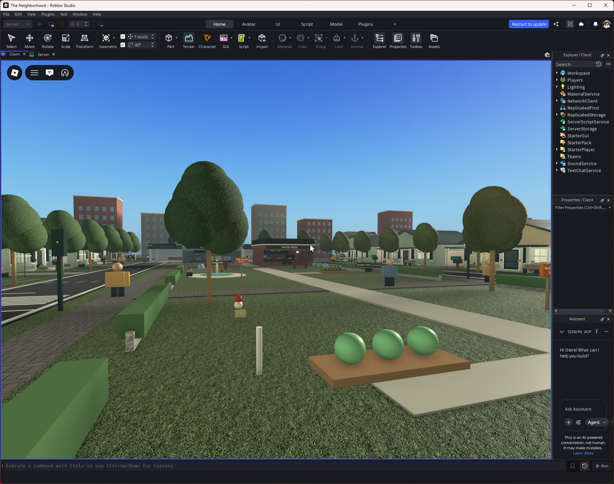
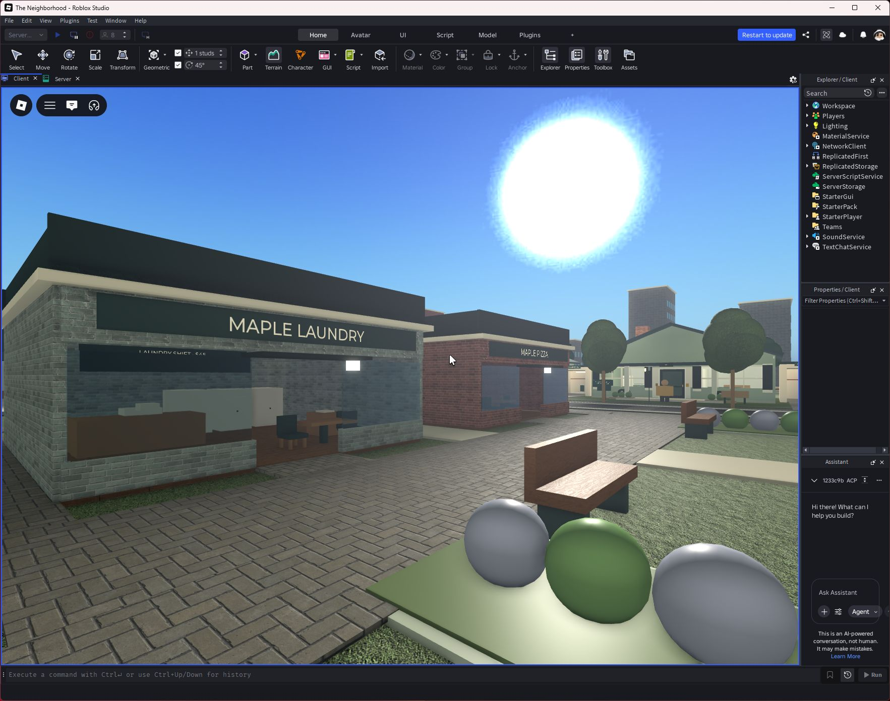
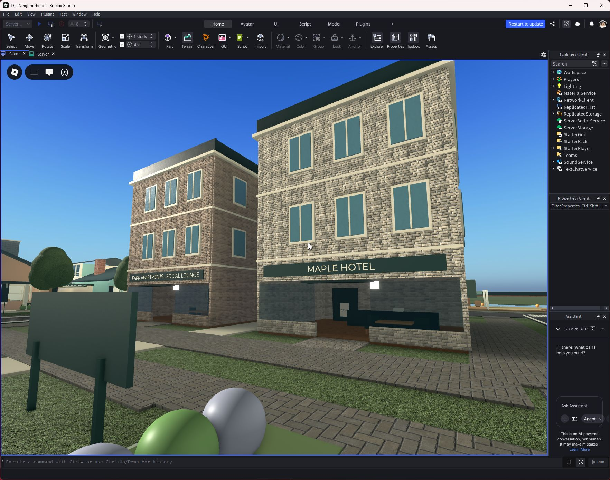
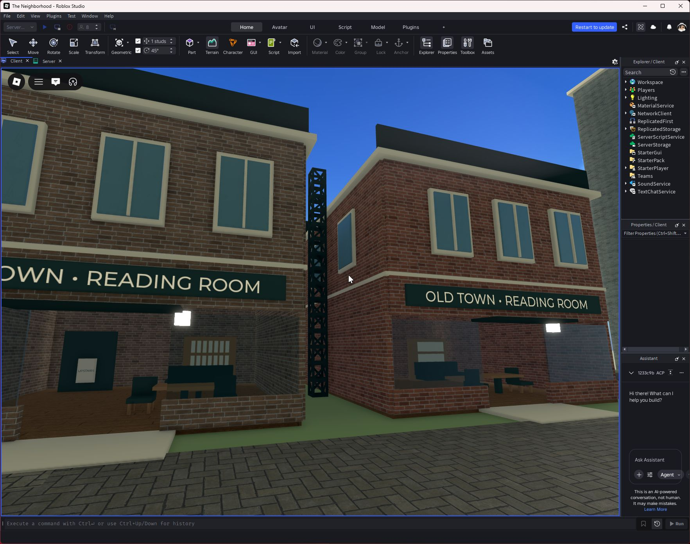
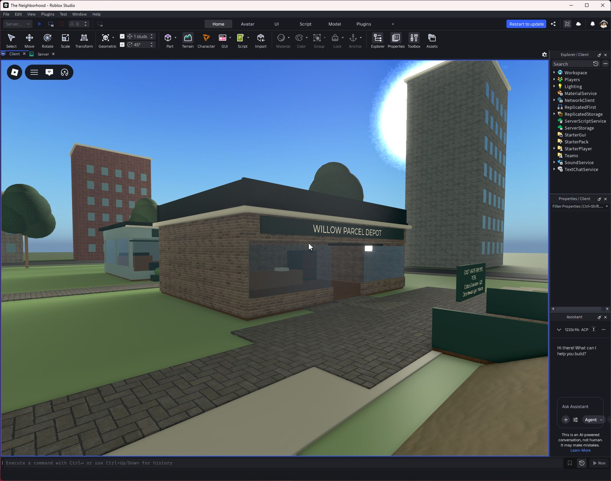
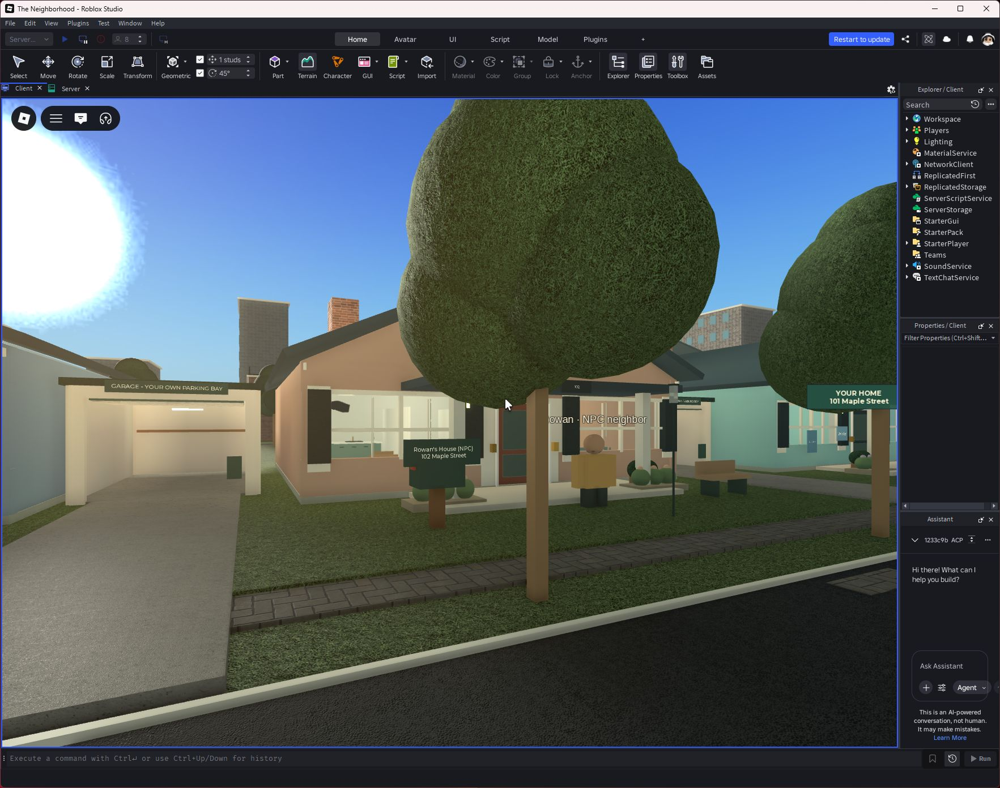
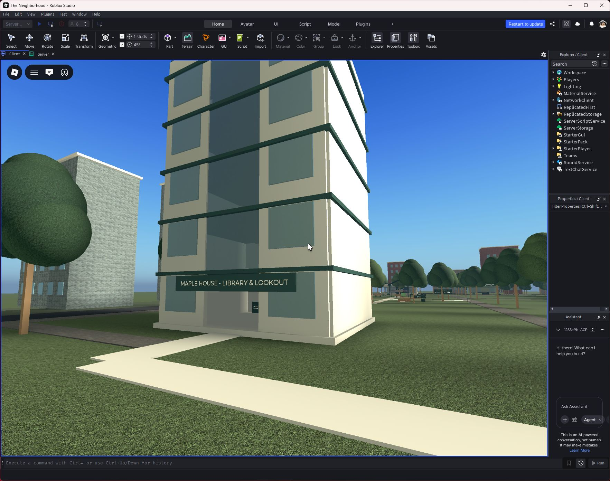
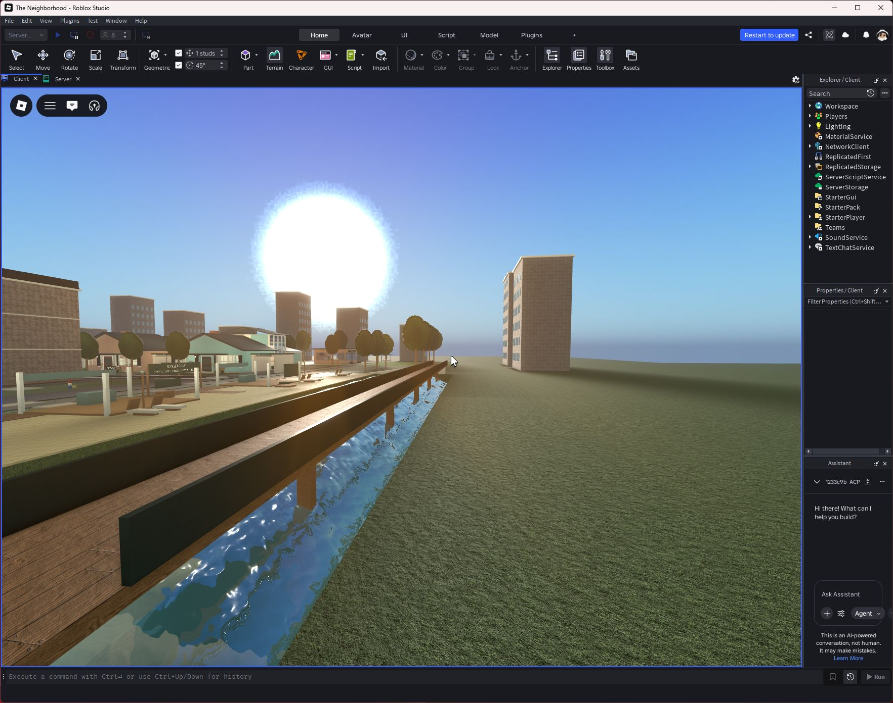
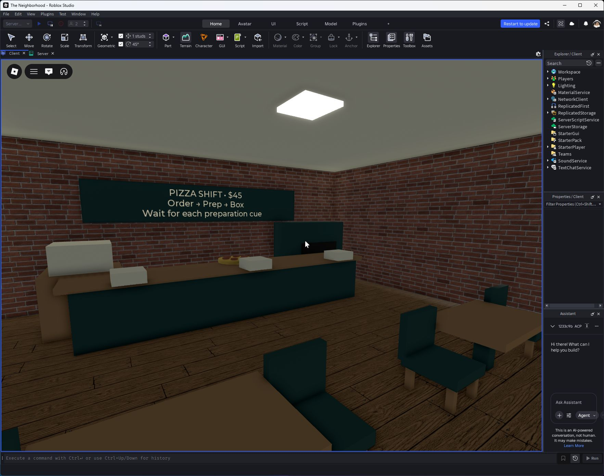
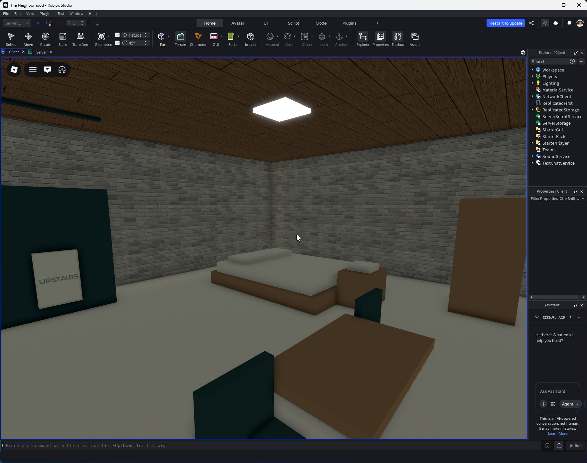

# Maple Heights

September 24, 2026. This pass implements the attached city redesign around the existing twelve-home neighborhood. The central green now has defined edges and nearby business frontages instead of a large unbounded empty center. House IDs, item ownership and saved furniture coordinates remain intact.

Published to the existing experience as **v85**, verified by Studio's successful publication record at **12:02:58 UTC**. Rejoin a fresh server to receive it.

## Built destinations

| District | Playable content |
|---|---|
| Maple Street | Twelve furnished homes, owner signs, interior arrivals, garages and scripted neighbors for vacancies |
| Neighborhood Park | Existing fountain, benches and activities retained within low garden walls and hedges; community delivery board and destination guidance grouped at the park entrance |
| Market Avenue | Furnished pizza shop and laundromat with three-stage paid shifts; existing cafe, general store, pawnshop, repair workshop and farm stand retained |
| Old Town | Two furnished two-floor brownstones, courtyard, stoops, climbable fire escapes and a connecting rooftop survey route |
| Uptown | Three accessible apartment lounge floors; hotel reception and two furnished guest-room floors with a housekeeping shift; existing library and rooftop lookout retained |
| Waterfront | Furnished parcel warehouse using the existing physical delivery system; real water, fishing, ferry, tackle shop and swimming beach retained; walkable cove bridge added |
| Surroundings | City silhouettes replace the mountain enclosure; perimeter streets connect through a southern boulevard and market lane, with deliberate bus turning courts |

Apartment floors are public social lounges, not additional purchasable homes. The hotel is a housekeeping destination, not a room-rental system. Skyline buildings are scenery with no entry prompts. Transit shelters are street detail; a bus service and airport are not advertised or implemented.

## Jobs and progression

Pizza and laundry shifts pay $45; housekeeping and rooftop surveys pay $65. Stations must be completed in order, with four seconds between steps and a ninety-second cooldown between paid shifts. Each shift contributes to the existing daily work objective. Server-side checks reject remote interactions, duplicate payouts and out-of-order steps. Rooftop surveys also reject position discontinuities. Warehouse work uses the existing delivery address, physical parcel, travel checks and mailbox reward flow.

## Verification

- Seven new building entrances traversed by a real humanoid. All city lift destinations exercised.
- Four job reward/order/timing/cooldown/distance suites passed using an isolated in-memory currency fixture. These station-placement tests are simulations, separate from physical walking tests.
- A humanoid climbed a fire escape, walked both roofs and their bridge, then walked up, across and down the cove bridge. Teleporting during a roof survey cancelled it.
- Actual Studio stop/restart/rejoin with a separate DataStore fixture retained currency, original item GUID and placement, locks, expansions, crafted furniture, layout, life progression and unfinished adventure progress. A change made after explicit save survived shutdown saving. Production progress was not reset.
- Eight actual simultaneous Studio clients passed home assignment, profile readiness, interior arrival, owner labels, four vacancy NPCs, library lifts, terrain swimming and skill-course completion/shortcut rejection. Housing slots 9–12 were exercised sequentially with a real player; this is not a twelve-client load test.
- A separate two-client foundation suite passed purchases, placement, storage, sales, owner/visitor permissions, vehicles, pets, events, mail, pranks, observations, lock breach, physical theft/escape, fencing, evidence, recovery and actual client-disconnect cleanup, with no server errors. Its injected-storage suite exercised 239 requests and 50 seeded settlement cycles; its separate real Roblox DataStore suite passed and removed its GUID-prefixed fixture.
- Two actual clients sent **830 remote requests** through the production network handlers. Malformed input and duplicate purchase bursts left protected data intact. Four actual character reloads preserved possessions, home and one HUD, with no client or server application errors. Rain, roof shelter and reduced-motion behavior also passed.
- Vehicle regression passed: no free starter car, insufficient-funds and duplicate-purchase checks, purchase/save schema, actual driving out of a garage, all twelve garages, owner/visitor controls, beach swimming and physical ball borrowing/tossing.
- All 38 newly authored entrance and sidewalk regions passed the final collision-obstruction scan. Pedestrian and overview screenshots were reviewed; fixes included obstructing trees, roof access, library glazing, seat supports and home markers showing through buildings.

Two test-harness failures were corrected and rerun: the carry test now walks through an entrance-aisle waypoint instead of aiming diagonally through the front wall, and the long bridge test refreshes `Humanoid:MoveTo` before its built-in timeout. Neither fix relaxes the production movement or reward checks.

Creator Dashboard's actual **Maximum Visitor Count was saved and reloaded as 12**. Studio automation here supports eight clients; twelve concurrent players and low-end mobile performance remain unverified. NPC neighbors use scripted routines, not autonomous AI.

Machine-readable results: [city jobs, traversal and persistence](qa/maple-heights.json). The [requirements checklist](MAPLE-HEIGHTS-CHECKLIST.md) tracks publication and delivery separately.

## Actual Studio screenshots

These are captures of the game running in Studio, with the gameplay HUD hidden for inspection. They are not generated concept art.

| Park | Market |
|---|---|
|  |  |

| Uptown | Old Town |
|---|---|
|  |  |

| Waterfront | Homes |
|---|---|
|  |  |

| Library | Cove bridge |
|---|---|
|  |  |

| Pizza interior | Hotel guest floor |
|---|---|
|  |  |

## Reproduction

Build `default.project.json` with Rojo; `builds/TheNeighborhood.rbxl` is the recoverable place. City architecture is deterministic and rebuilt during server initialization. Test scripts under `tools/test-city*.server.luau` must run as normal server Scripts during an isolated Studio session; they are not installed as production gameplay scripts. The traversal harness must have client movement controls disabled while it drives the humanoid.

The city checklist is the bounded scope of this release. It does not certify completion of every idea in the much larger original master specification.
