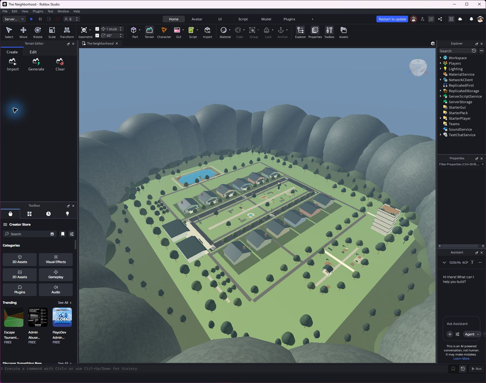

# Twelve-home renewal

The district now contains twelve nearby cottages with named ownership labels and interior spawning. Bootstrap initialization no longer broadcasts state before dependent services are ready; player characters load only after home assignment. This fixes the observed profile-loading interaction failure and default-spawn race.

The redesign adds real terrain lake water, six curated recreation stations, connected walks, scripted NPC neighbors for vacant homes, persistent trial records and XP, a five-story library with lobby and rooftop lift, and quiet client music with a saved toggle. Upper library floors are facade volume, not apartments. NPCs follow scripted routines, not generative AI.

Eight real Studio clients passed the renewal acceptance suite: distinct ready profiles and named homes, interior arrival, all twelve housing slots assigned sequentially, four vacant-home NPCs, swimming, both lift directions, trial awards/cooldowns, repository save/rejoin, actual sprint movement, and teleport-shortcut rejection. Normal persistent Studio checks also passed profile faults, home respawn, datastore saving, music playback and mute/unmute. Twelve simultaneous live players were not tested. The last checked platform server limit was eight; twelve authored homes do not automatically change Roblox's configured capacity.

Background music: Clarinet Boutique, DistrokidOfficial, Creator Store audio asset 133008423061710, volume 0.12. No paid asset purchase was made.

The renewal was published with Studio success confirmation on September 24, 2026 at 10:50:41 UTC; Studio output linked publish notes to v72. The cloud place was not reopened for a new version-number comparison. Older README sections describe historical builds.

