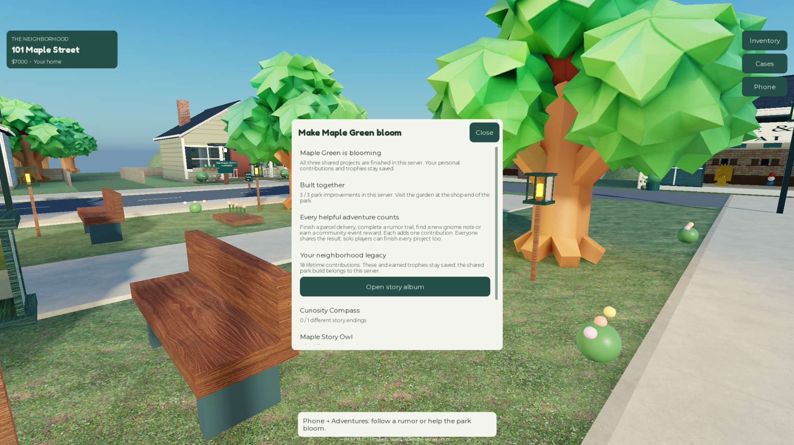

# Maple Adventures QA — September 23, 2026

## Outcome

The adventure acceptance suite and all 12 existing regression suites passed. The expansion was also checked through a real Studio stop/rejoin and actual mouse input. These results cover implemented behavior; they do not certify long-term retention, production performance, public-client travel, or the complete master specification.

Evidence: [suite results and earlier attempts](qa/adventures-regression.json), [restart, mouse and navigation checks](qa/adventures-restart.json).

## New activities

- Six stories with three physical clue posts per route, saved chapters/endings, replay counts and optional uninterrupted personal bests.
- Three cooperative park improvements; all can be completed solo or with others.
- Three exclusive display trophies with persistent, one-time claim receipts.
- Adventures and Projects phone screens, a physical board and current-clue HUD.
- Existing profiles gain validated adventure defaults without losing earlier progress.

## Executed checks

| Check | Result |
|---|---|
| Adventure acceptance | Two clients; two distinct stories walked through production movement checks; four full walking legs |
| Story simulations | All six endings; 40 checkpoint replay simulations; repeats do not reissue first-completion cash or overwrite timed records |
| Invalid requests | 2,100 malformed adventure actions; forged posts, wrong/distant chapters, duplicate starts and teleport advancement rejected |
| Trophy lifecycle | Full inventory defers rewards; all three claim once and render; earned-only shop rejection; selling preserves collection/receipt |
| Shared projects | All three park improvements appear and both clients see shared completion |
| Profile lifecycle | Old-profile defaults, six corrupt album shapes, closing-profile refusal and death/checkpoint preservation |
| Real DataStore | Isolated GUID fixtures retain album, best time, trophy receipt, contributions and active chapter across repository release/reload; fixtures removed |
| Full stop/rejoin | New adventure fields were changed after explicit saving, then survived actual server shutdown/restart through the ordinary profile flow |
| Mouse flow | Phone → Follow a rumor → Resume on foot; server job and HUD clue confirmed; panel closed; Shared park projects opened |
| Navigation | Six new story posts had successful navigation paths; existing art suite passed 23 routes |
| UI | 20 screens × two widths × two clients = 80 render/close/text-fit checks |
| Existing gameplay | Economy, possessions, theft/recovery, cases, locks, cars, pets, deliveries, weather, friends, plot selection and disconnect races passed |
| Abuse/lifecycle | 368 actual existing remote probes, four respawns, 100 item cycles, 600 rejected item transitions, 600 cosmetic equips and 800 invalid cosmetic requests |
| Storage stress | 20 seeded runs, 5,000 settlement/spending cycles, 20,800 injected storage requests; album release/reload assertions included in each run |
| Capacity | Eight real Studio clients, distinct homes/profiles, eight cars and eight pets; no application errors |

Checkpoint replay simulations intentionally relocate paused players, then resume at a marker. They verify checkpoints, ordering, receipts and replay behavior; they are not additional physical walking evidence. Park preview screenshots use a controlled fixture to stage completion.

## Corrections during verification

The first checkpoint fixture placed both test characters at the same post, so the other avatar correctly blocked the interaction ray. Separating them fixed the fixture without weakening line-of-sight checks. A trophy assertion originally counted arbitrary descendants; it now checks for visible geometry, which correctly accommodates the compass's three visible parts.

One cosmetic-suite invocation returned no result from Studio automation. It was not counted as a pass; its rerun passed. Earlier attempts remain in the evidence file.

Visual inspection caught compressed text on the library roof and overly bright lantern bodies. A separate short library sign and framed glass lanterns with small warm candles replaced them. The adventure suite was rerun after those final visual edits.

## Limits

The local eight-client capacity run measured **31.18 ms mean / 115.53 ms p95** server frames (255 samples), with about **497.5 MB** server memory. Its baseline was 35.90 / 128.56 ms. This is a functional pass with substantial frame spikes, not a performance pass or a mobile-device benchmark.

The shared park build is current-server state; personal stories, records, contribution totals and rewards are durable. Neither this test nor the expansion adds cross-server saved construction. Native public-client friend travel, real touch/controller operation, production budgets and unfamiliar-player fun tests remain open.

The six stories are a finite content set. They establish reusable story/project systems; only player feedback can establish whether they keep people entertained long term. No publication or pass-sale change was performed by this expansion.

## Visual evidence and cleanup

The album screenshot shows an isolated real restart fixture. Park completion was staged in a memory-only preview. Studio returned to Edit mode and its default viewport; all Workspace fixture attributes were cleared. The mouse helper emitted CoreGUI pointer-movement warnings; the targeted actions and observed application outcomes succeeded.

[All 14 changed source scripts matched Studio](qa/adventures-source-parity.json). No application source was injected by the screenshot fixtures; temporary runtime helpers disappeared on stop.
