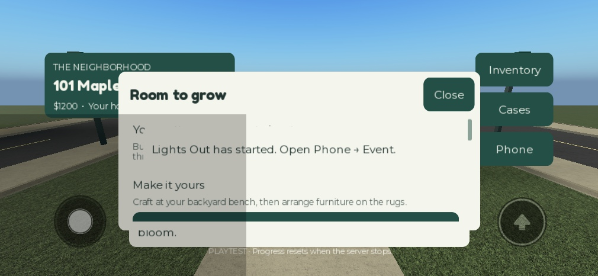
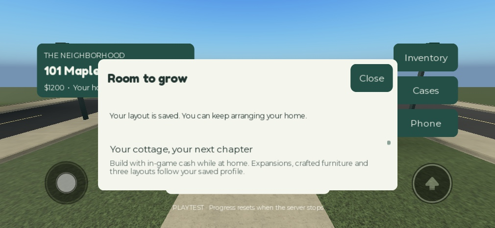

# Expanded regression retest — September 23, 2026

This follow-up keeps local gameplay verification separate from Roblox platform and online-service verification. Both connected editors were local files; the QA place reported PlaceId 0 and UniverseId 0. No publication or production data changes were made.

## Added checks

The network suite now sends malformed values through all six building actions using the production remotes, then issues a legitimate garden-room purchase followed by 100 duplicate requests from each of two actual clients. The server checks exact currency, one unlock and the generated room. The run passed **690 real remote requests**, followed by four actual character reloads and weather/HUD checks with no application errors.

Building tests now include an actual seated driver moving a car out through the new garage entrance. Server fixture input prevents an idle test client from overwriting the throttle; this tests physics and doorway clearance, not keyboard/controller input.

Capacity diagnostics now retain all eight-player gameplay assertions, frame samples and error logs instead of throwing away the report at the first client error. **Passed still requires zero errors**; the test has not been made green by suppressing Roblox errors.

## Known platform failure

The eight-player cars/pets/rain suite reproduced Roblox CoreGui PlayerPermissionsModule / CreatorType errors and a Roblox Script Context.StarterScript CreatorType error. All eight houses, independent balances, cars with stable suspension, pets and forty rain streaks per client reached their assertions, but the overall run remains failed. The diagnostic ApplicationErrors field contains the unclassified Roblox StarterScript error; it does not establish a defect in the game's own scripts.

That run measured approximately **18.0 ms p95 server heartbeat** over 481 loaded samples. The expanded-home tests measured about **18.0 ms with two clients** and **214 ms with eight clients**. Different workloads and substantial variation between runs mean these measurements are not a production/device performance certification.

## Online checks still blocked

Real DataStore save/rejoin for expansion fields, real Roblox teleports and cross-server handoff require an authenticated published place. Local storage stress uses an injected backend, and friends travel uses an injected transport. Those are useful tests, but neither is proof that the corresponding online service works. The complete master specification, unfamiliar-player usability and real device/controller testing remain open.

## Mobile issue found and fixed

iPhone 13 landscape emulation exposed a notification covering the open home-planning controls. Notifications now occupy a reserved section inside an open panel, the action list moves below them, and the bottom world hint hides while the panel is open. Existing visible toasts migrate into the panel when it opens. Closing/expiry restores the full list area.

The expanded UI suite passed **120 checks**, including notice text fit and non-overlap at 510px/360px widths and 480px/220px heights on two clients. This is emulation and rendered geometry verification, not physical touch hardware certification.

## Performance snapshot

An isolated one-client preview with all eight homes expanded and furnished produced **128 MicroProfiler frames with 17.22 ms p95**. CPU scope totals are inclusive across threads and are not exclusive work or a critical path. This did not reproduce the eight-client spikes. The final physical garage-exit run passed with two and eight clients; its p95 values were approximately 18.08 ms and 449.40 ms respectively. Performance therefore remains an open verification concern.

## Final result and evidence

**14 suites passed; CapacityAcceptance remains failed on Roblox platform errors.** The UI and network suites passed again after the mobile fix. The garage-drive assertions passed with both two and eight actual clients. No online publication or production saves were performed.

[Complete raw attempts](qa/expansion-retest.json) · [MicroProfiler snapshot summary](qa/expansion-performance.json) · [UI source audit](qa/retest-ui-audit.json)

The final emulator check used a 749 × 368 viewport. The notice fit its reserved area; the action list began eight pixels below it. The list regained its full height on expiry, and mouse input opened Saved Layouts after scrolling. Controlled notification text in the capture is a UI fixture, not a real DataStore save receipt.

| Before: notification overlaps the panel | After: reserved notice above scrolling actions |
|---|---|
|  |  |

The test runner now waits between sessions and records a missing result as a failure, stopping before it can stack more sessions on an abandoned test server.

Final source parity: all 78 scripts matched the tested Studio edit model. Rojo rebuilt the place, the strict UI source audit reported zero findings, and repository checks passed for 43 JSON files, 23 guides and 113 local links.
