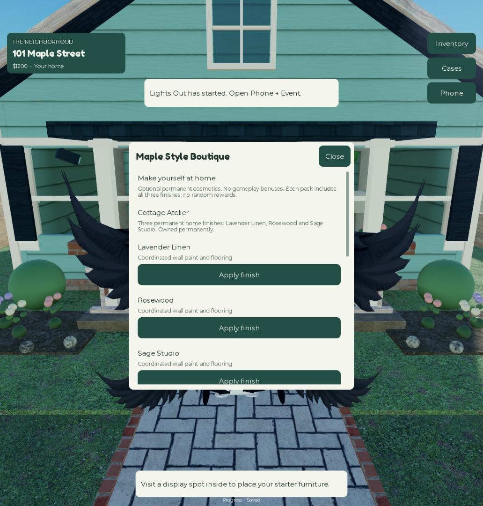

# Full regression — September 23, 2026

## Outcome

All 12 named automated suites passed on the current implemented game. A separate, real Studio stop/rejoin cycle passed using an isolated DataStore scope, and its fixture was removed. This is a broad regression of implemented features, **not a claim that every requirement in the master TXT is implemented or that all production/device scenarios have been tested**.

Raw evidence: [suite results](qa/full-regression-results.json), [restart and manual UI](qa/restart-and-ui.json), [source manifest](qa/source-manifest.json), [Studio/source parity](qa/source-parity.json).

## What ran

Counts below describe the main run of each suite; repeated verification runs are retained in the JSON and are not added to inflate these totals.

| Suite | Clients | Verified result |
| --- | ---: | --- |
| FoundationAcceptance | 2 | Full possession/economy/theft/escape/fence/reclaim loop; evidence, locks, permissions, activities, physical car and pet; 239 injected storage calls and real DataStore fixtures |
| FriendsAcceptance | 3 | Consent, readiness, saved membership, save/transport failures, partial departure, private access codes; 101 directory requests; real directory fixture reload and cleanup |
| PlotChoiceAcceptance | 3 | 56 nearest-plot steps, chosen plots, conflicts, offline reservations, reverse arrivals and live directory reload |
| ExplorationAcceptance | 2 | Actual parcel path, cancellation/death/teleport rejection, five clues, inventory-full reward retry, collection, weather and 18 malformed requests |
| NetworkAcceptance | 2 | 368 actual remote requests, including malformed boutique/friend requests; four respawns; rain, shelter and reduced-motion behavior; no application errors |
| LifecycleStress | 2 | 100 buy/place/store/sell cycles over all 10 store collectibles; 600 rejected invalid transitions; world instance count unchanged at 41 |
| DisconnectRaceAcceptance | 2 | Actual disconnect while property was carried; injected four-second save delay; no late resurrection or new theft during closing |
| ArtAcceptance | 2 | 23 reachable navigation routes; 1,812 decorative parts, 320 siding textures, 104 textured meshes; gameplay collision/query constraints |
| CapacityAcceptance | 8 | Eight independent homes/profiles, eight cars, eight pets, 40 visible rain parts per client, stable parked cars and no application errors |
| BoutiqueRegression | 2 | 600 style equips, 24,000 texture checks, 800 invalid requests; cancellation, unverified ownership, outage/retry, revocation, isolation, rate limiting and purchase/refresh race |
| UIAcceptance | 2 | 18 screens at 510px and 360px panel widths on both clients: 72 render/close/text-fit checks |
| StorageStress | 1 | 20 seeds, 5,000 settlement/spending cycles, 20,800 injected storage requests; duplicate payments, lost acknowledgements, leases, corrupt records and migration |

## Fixes made during this audit

1. **Purchase completion during an ownership check:** the old busy branch returned immediately and could drop the purchase-triggered recheck. Refresh now queues another lookup, publishes its final ownership snapshot, and cleans up departing-player state. A deliberately blocked lookup reproduces the ordering and verifies both entitlements after the queued refresh.
2. **Restart fixture key length:** the first new restart fixture prefixed a GUID to a real user ID, exceeding Roblox's 50-character key limit. That attempt failed without writing a profile. The corrected harness uses the GUID as DataStore scope and ordinary short player keys.
3. **Studio/source text mismatch:** final parity checking found a malformed price separator in Studio's BoutiqueScreen. Studio was synchronized to the repository's correct UTF-8 source.
4. **Documentation drift:** the specification ledger incorrectly still said GitHub/Higgsfield were unavailable. Those entries now reflect actual delivered work. Monetization and QA are indexed, and CI checks links in every Markdown guide.

## Actual restart and mouse flow

Normal Studio Play used `TheNeighborhood_RejoinFixtures_v1` with a unique GUID scope, not production or normal development profiles. Phase 1 placed the original lamp, locked the house, saved a boutique selection, explicitly saved, then changed a shutdown-only counter. After stopping and starting a new server, phase 2 verified currency, the original GUID/display slot, lock, shutdown counter, recap and boutique selection. Cleanup removed the scoped record and all Workspace fixture flags.

The signed-in creator account's real pass ownership appeared in the boutique after rejoin. MCP mouse input opened Phone → Browse styles → Apply finish. The resulting server floor color/material matched Lavender Linen and the screen closed successfully. This verifies an owned cosmetic's UI-to-server equip path; it is **not evidence of a new buyer paying and receiving a purchase**.

The mouse helper emitted CoreGUI pointer-interpolation warnings during movement; the targeted clicks and observed outcomes succeeded. Automated client/server suites had no application errors. Physical touch/controller input remains unverified.

## Capacity limits

The eight-client local run measured:

- Mean server frame: **28.03 ms**; p95 **86.37 ms** across 283 samples.
- Server memory: **1,625.4 MB**; 3,998 world descendants.
- Pre-car/pet baseline: mean **33.47 ms**, p95 **125.86 ms**.

This is a functional capacity pass, not a performance acceptance pass. Eight Studio client processes shared one computer. These spikes need profiling on target devices and real servers; no mobile FPS, production latency or large-scale reliability claim is made.

## Reproduce

1. Sync the repository into the intended Studio place, stop Play, and enable Studio API access for live fixture tests.
2. Run [run-studio-suites.luau](../tools/run-studio-suites.luau) through Studio's Edit command bar/MCP. It runs one session at a time and prints each result. Individual commands are in [TESTING](TESTING.md).
3. For restart testing, set `PersistenceFixture` to a fresh 36-character GUID and `PersistenceCycle=1` in Edit. Start normal Play; record the JSON in `PersistenceCycleResult`.
4. Stop Play. Set `PersistenceExpected` to that JSON and `PersistenceCycle=2`; start Play again and verify `Passed=true`.
5. Stop Play. In `TheNeighborhood_RejoinFixtures_v1` with the exact GUID scope, remove only the fixture's `player:<recorded user ID>` key. Clear the four `Persistence*` attributes. Never delete normal player data.
6. Run `python tools/check_repository.py` and `rojo build default.project.json --output builds/TheNeighborhood.rbxl`.

Explicit named automated sessions use memory player profiles. Live modules use separate isolated DataStore fixtures. Test scripts are Studio-gated and cannot execute in a published server.

## Remaining release gates

- Real published-client reserved-server travel, lease handoff, friend/privacy/cross-play behavior, partial failures and founder-offline return. Studio transport was injected.
- A separate buyer's native purchase confirmation/cancellation, successful delivery and cross-server ownership restore. Both passes remain **off sale**; no Robux was spent.
- Real phones/tablets/controllers, lower-end device performance, longer-duration soak, production budgets and adverse network conditions.
- Human onboarding/fun evaluation and unimplemented master-spec features, tracked in [SPEC-COVERAGE](SPEC-COVERAGE.md).

Publishing, account eligibility and public availability are separate from GitHub delivery. This task does not publish the game or enable pass sales.

## Delivery verification

All 68 Studio scripts matched the repository after UTF-8/LF normalization. Workspace test attributes were cleared and Studio was left in Edit mode. The repository validator passed 35 JSON files, 18 Markdown guides and 63 local links. Rojo 7.7.0 rebuilt the downloadable place successfully.

Local build SHA-256: `1619287845e1321d210107d86073ffd8f76c910bf26da32fed799194b62ffe56`. GitHub Actions rebuilds from the pushed source; its run is the external CI record.
