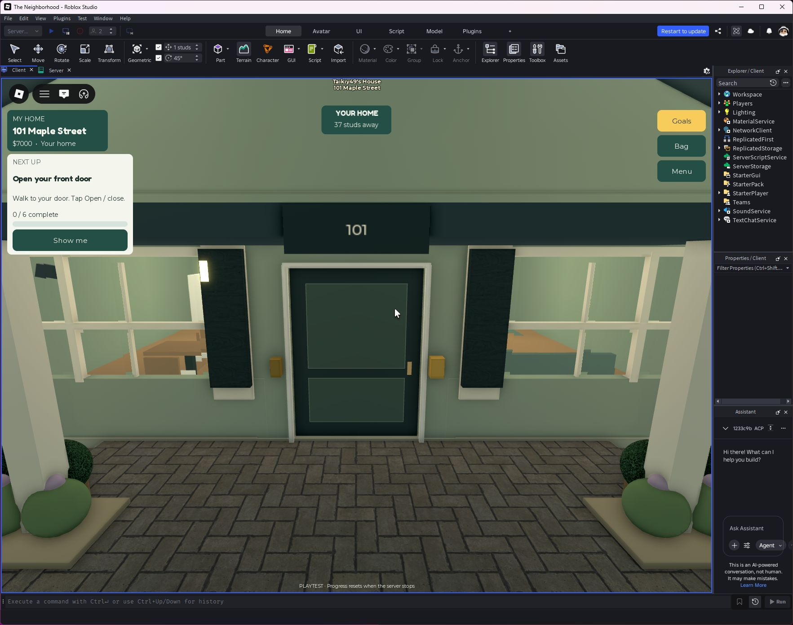
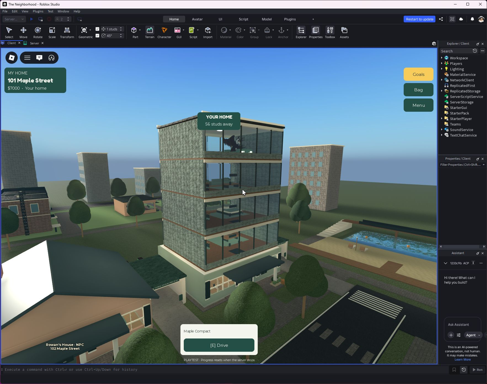
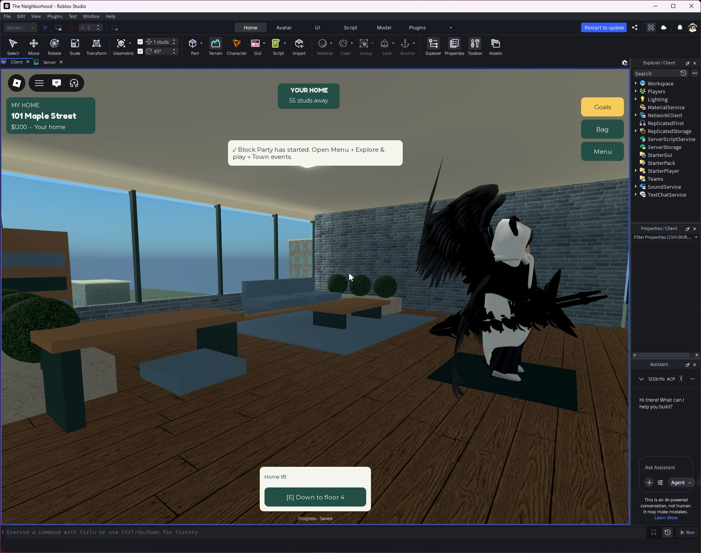
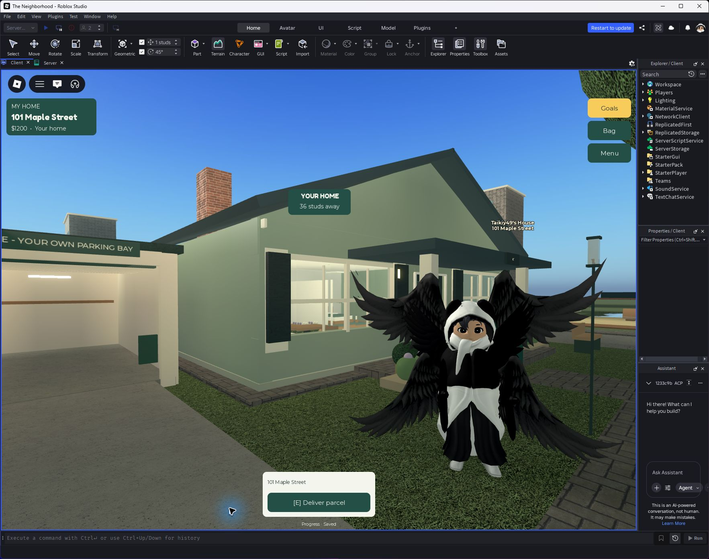
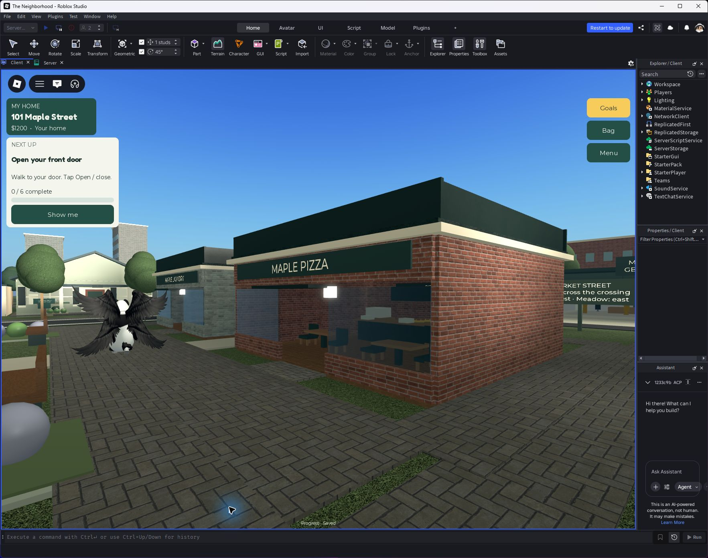
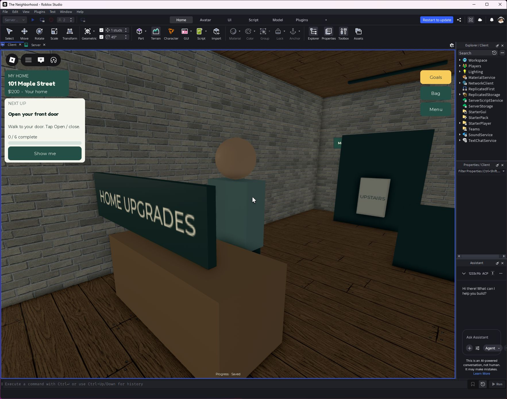

# Grow your home

Published as **v100** at **13:13:03 UTC, September 24, 2026**. Studio confirmed PublishSuccessful for place 111572448337932.

The main progression now emphasizes earning, making a home and living in the neighborhood. House mischief and investigations remain optional activities.

Open Goals → See home plans, or Menu → Home & belongings → Grow my home. Find Avery at the housing desk inside the Maple Hotel lobby. Upgrades require earned game cash and completed city jobs or parcel deliveries; there is no Robux purchase in this feature.

| Home | Floors | Upgrade cash | Total completed jobs/deliveries |
|---|---:|---:|---:|
| Maple cottage | 1 | Starter | 0 |
| Parkside townhouse | 2 | $2,500 | 8 |
| Family residence | 3 | $6,500 | 25 |
| Skyline residence | 5 | $16,000 | 60 |

Buildings grow vertically on the existing plot. The garage, inventory and purchased ground-level rooms remain. Upper floors contain furnished living/work spaces and a home lift. Locked houses reject unauthorized lift use. The private home marker rises above the upgraded roof and measures horizontal distance.

After the skyline tier, repeat renovation projects require new completed work and cash, award a renovation rank and cycle three interior palettes. Prices cap at $10,000; projects need 8–16 fresh jobs. This is repeatable progression, not infinitely many unique buildings: four architectural tiers, three palettes and a defensive numeric limit of 1,000,000 renovations are implemented. No progress resets, mandatory streaks or time pressure.

## Surface cleanup

Raised grass pads beneath houses are hidden and replaced with stone aprons; porches use matching pavement. Coplanar opaque block surfaces were separated, with gameplay-critical parts protected. Awning stripes, roof crowns and orchard paving received specific corrections. The final static runtime audit returned zero candidates, down from 1,140 before its pass. The audit excludes transparent surfaces and non-axis-aligned geometry; it does not certify every visual artifact on every device.

## Screenshots

## Verification

Two-client residence acceptance (also with Garden Room, Loft, Garage and Workshop purchased) covers migration, bad profile rejection, distance checks, all upgrade prices, duplicate charge prevention, plot/inventory/garage retention, lift movement and locked visitor rejection, fresh-work renovation gates, insufficient funds, serialization and release/restore. See `qa/residence-runtime.json`.

A separate isolated real DataStore profile was saved, Studio stopped, and a new session restored tier 4, renovation 2 and Blue styling. This does not modify the owner's real profile. See `qa/residence-persistence.json`.

UI acceptance passed 290 screen/layout checks across two real Studio clients, including upgrade and renovation confirmation bodies, failed-request recovery and private home markers. See `qa/residence-ui.json`.

Network regression passed 830 malformed/burst/legitimate requests and four character reloads, with no server or client application errors. See `qa/residence-network.json`.

Visual inspection included cottage, townhouse, skyline exterior, furnished upper floor and housing desk. Existing servers must restart or players must join a new server to receive published code. Mobile hardware, long-term economic balance and maximum-tier homes across all 12 simultaneous players still need live observation.
