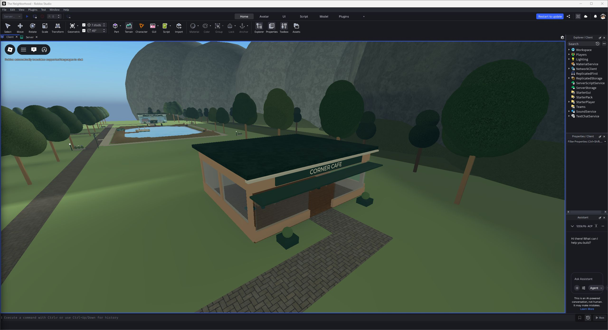
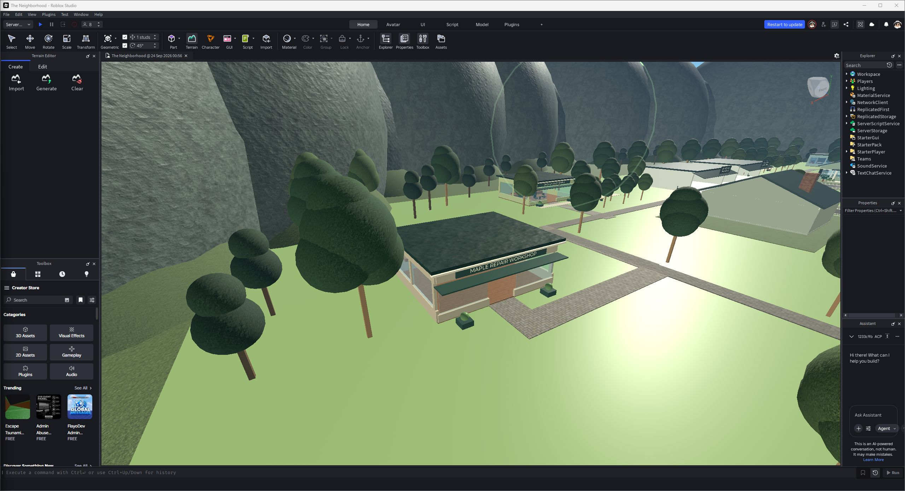

# Side destinations — September 24, 2026

Four enterable, furnished buildings now occupy the side districts, connected to the existing pedestrian network:

| Destination | Location | Activity |
|---|---|---|
| Corner Cafe | Northwest, beyond the western homes | Free tea tool; equip and activate to drink; seating and pastry display |
| Willow Bait & Tackle | Southwest, south of the lake | Fishing instructions and tackle displays; adjoining catch-and-release deck |
| Maple Repair Workshop | Southeast, south of the meadow | Timed vintage-radio repair for $30 |
| Orchard Farm Stand | Southern orchard | Free apple tool; equip and activate to eat |

Fishing awards $25 when the player responds within two seconds of the server's BITE notification. Repair uses a READY notification and the same two-second window. Rewards share a 60-second per-player session cooldown. Interactions use the existing server profile, distance, line-of-sight, target/action and rate-limit validation. Rewards feed the existing saved currency; no Robux purchase is involved. Tea and apples are temporary, non-droppable items, limited to one snack per player and cleaned up after three minutes.

The buildings have one open entrance each, display windows, interior lighting, counters, furniture, destination-specific props, elevated fascia signs and front planting. Terrain water, existing shops, ferry, homes and library remain available. These are modest furnished destinations, not complete restaurant-management or fishing-inventory systems.

## Verification

A real Studio play session walked a Humanoid through all four entrances and used each counter. Tea and apples appeared in Backpack; duplicate tea was rejected. Actual delayed cue/response sequences awarded repair and fishing currency, the cooldown rejected another reward, and a remote fishing request was rejected. Test-earned currency was restored immediately. An overlap query found zero blocking props above the seven new connector paths. The final cosmetic pass raised the cafe menu, added espresso-machine details and chair backs, and lightened ceilings; it did not change interaction logic.

The Rojo build succeeds. These checks are not a full twelve-player live test or proof that every historical specification item is finished.

See [machine-readable test results](qa/side-destinations.json).
