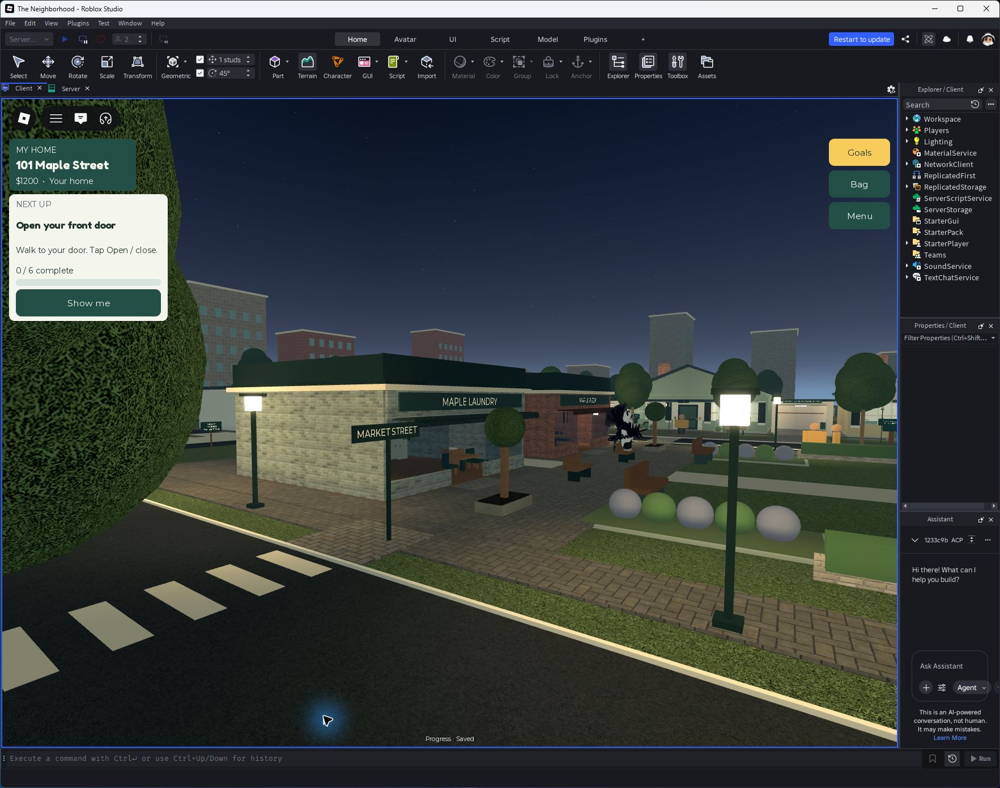

# Town street details

A coordinated furnishing pass around Market Street and Park Square: 12 dusk-sensitive streetlamps, four public benches, two outdoor seating tables with four seats, four contained tree planters, two litter bins, two shop awnings, and double-sided street-name signs at real crossings.

Four crossings replace the old marks at the same junctions instead of layering over them. Each has five painted bars and a paved approach. Furniture remains outside the market doorway routes.

Verified in Studio: 12 lamps enable at night and disable by day; raycasts through both market entrances found no new blockers; walked into the pizza shop; a public bench seated the character; 20 crossing bars exist; the supported coplanar-face audit returned zero for the new street details after refinement. Day and evening screenshots were inspected. No full gameplay regression rerun was needed for this scenery change; physical mobile input and every sightline are not certified.

